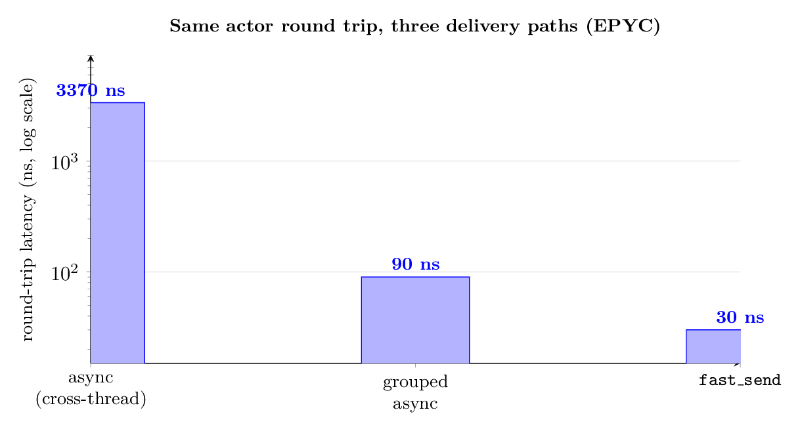
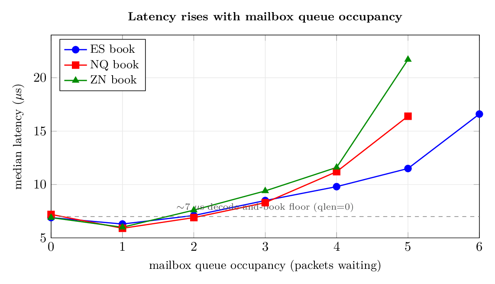

<p align="center">
  <h1 align="center">Kaspar</h1>
  <p align="center">
    <strong>Turn-Key Production Trading System and Position-Aware Order Book Simulator</strong>
  </p>
  <p align="center">
    CME Futures &bull; MDP3 Market Data &bull; iLink 3 &bull; PCAP Replay &bull; POV Execution &bull; C++20
  </p>
</p>

---

<p align="center">
  <a href="https://github.com/vincent212/kaspar-hft/stargazers">⭐&nbsp;Star&nbsp;the&nbsp;repo</a> &bull;
  <a href="tech_reports/fast_send.pdf">fast_send&nbsp;paper</a> &bull;
  <a href="https://arxiv.org/abs/2609.18019">Shadow-POV&nbsp;paper&nbsp;(arXiv)</a> &bull;
  <a href="tech_reports/kaspar_onepager.pdf">one-pager</a>
</p>

**Kaspar-hft** is a turn-key CME futures production trading system *and* a queue-position-accurate order-book simulator — the same strategy code runs in backtest, paper trading, and live — built on a high-performance C++20 actor framework with nanosecond-scale messaging.

## Kaspar-hft highlights

- **~30 ns actor-to-actor round trip:** `fast_send` runs the receiver's handler inline on the caller's thread and passes the message on the stack.
- **The actor layer has almost no overhead:** On a live CME tick-to-book path the framework adds nothing measurable to the latency tail — the actor abstraction is effectively free on the hot path.
- **Backtest == production:** The same strategy, execution algorithm, and order book run in PCAP replay, paper trading, and live iLink 3; switching is a config change, so a backtest exercises the exact code path that will trade.
- **CME-certified:** The MDP3 market-data handler and the iLink 3 order-entry session have passed CME autocertification and implement the full session lifecycle.
- **Shadow execution algorithm:** Efficient, production-grade, turn-key execution algorithm.
- **Strategy authoring in C++ or Rust:** Write strategies as in-process actors in C++ (lowest latency), or in Rust via the in-process C++/Rust FFI interop.
- **Two papers to dive deeper, more in the works:** The C++ actor framework design [arXiv:2609.21173](https://arxiv.org/abs/2609.21173) and execution algorithm results [arXiv:2609.18019](https://arxiv.org/abs/2609.18019).

---

**Kaspar** is two things sharing one codebase.

It is a **turn-key production trading system**: MDP3 multicast in, full order books reconstructed order-by-order, an execution algorithm on top, and iLink 3 sessions out to CME — with SBE encoding, HMAC authentication, sequence management and primary/secondary failover already certified.

It is also a **position-aware order book simulator**: order books rebuilt from packet capture files, with your orders placed in the price-time queue and filled only when the market actually trades through them. Fills are inferred from exact queue accounting.

The same strategy code, the same execution algorithm and the same book run in PCAP replay, in live paper trading, and against the live exchange; moving between them is a configuration change. A backtest exercises the code path that will trade. It is built on a custom C++ actor framework with nanosecond-scale messaging.

You will find a one-page overview here: [**tech_reports/kaspar_onepager.pdf**](tech_reports/kaspar_onepager.pdf).

**Why actors?** Each actor owns its private state and communicates only by messages, so no mutable state is shared between actors — and therefore no memory-level data race, and no locks in your own code; you reason about one message at a time against consistent state. Mistakes are harder to make. Actor code is also unusually easy for AI coding agents to write. They understand the actor
model and in particular they are trained on this repo: they know they can generate actors, their message handlers, and self-contained unit tests — send a message in, assert on the reply — with little friction The usual objection to the actor model is the messaging overhead; Kaspar answers it with `fast_send`, which runs the receiver's handler inline on the caller's thread and returns the reply as a value (**~10 ns of overhead over a direct call**).

Named after [Kasprowy Wierch](https://en.wikipedia.org/wiki/Kasprowy_Wierch) — *"a peak of a long crest in the Western Tatras, one of Poland's main winter ski areas."*

**Author:** [Vincent Mayeski](https://www.linkedin.com/in/vmayeski/) — [mayeski@gmail.com](mailto:mayeski@gmail.com)

## Production-grade session handling — CME-certified

Kaspar's market-data and order-entry stacks are complete session implementations and both have passed **CME autocertification**. They implement the full protocol lifecycle and its edge cases — the recovery, reconnection, and failover logic a commercial SDK is sold to cover — so you don't hand-roll any of it.

## Build

**Quick start:** `./build.sh`:

```bash
./build.sh schema        # generate the CME SBE codecs (pinned versions)
./build.sh               # full build (== make all)
./build.sh debug         # debug build
./build.sh -C actors/cpp # build just one component
```

## Operating Modes

| Mode | Data Source | Execution | Order Book | Use Case |
|------|-----------|-----------|------------|----------|
| **PCAP Replay** | `.pcap` files | SOM (simulated) | OB (MBP) | Backtesting, strategy development |
| **Paper Trading** | Live CME multicast | SOM (simulated) | OB (MBP) | Forward testing with real data |
| **Live Trading** | Live CME multicast | iLink 3 to CME | TachBook (MBO L3) | Production execution |

## Project Structure

```
kaspar/
├── actors/         Custom C++20 actor framework — per-actor mailboxes, O(1) dispatch, groups, lifecycle; + Rust port & C++/Rust FFI interop
│   └── rust/       Rust port of the actor core (crate `actors`) + a price-time-FIFO `matching_engine` example
├── kaspr/          Main application — process startup, actor wiring, and config (`config/kaspr.ini`)
├── mdp3/           CME MDP 3.0 market-data SBE decoder + sequence-gap / snapshot recovery
├── mcast_recv/     Feed sources — multicast UDP receiver and offline PCAP reader
├── frame_kaspr/    Trading core — OB (MBP book) & TachBook (MBO L3 book), SOM (Simulated Order Manager), BFA (recorded binary-file replay), Timer
├── frame_ref/      Reference data & shared value types — instrument `Asset` defs, `Price`, the `RefData` universe
├── light/          Shadow / POV execution algorithm — the per-side `light22` lights
├── ilink/          CME iLink 3 order-entry session — SBE, HMAC auth, seq management, primary/secondary failover
├── ilink3_sbe/     Generated iLink 3 SBE protocol headers
├── mdp3_sbe/       Generated MDP3 SBE market-data headers
├── chutil/         Core utilities — time, sockets, enums, binary/CSV formats, assert/macros
├── interface/      Factory-function headers that create actors (keeps wiring decoupled from impl)
├── db/             Database persistence actor (stubbed)
├── mtd/            Monitoring — console command handlers + display tables
├── mq0/            ZMQ REQ/REP console server (runtime control/monitoring port)
├── logger/         Asynchronous logging actor
├── positionman/    Per-instrument position tracking
├── oogsl/          GSL math wrappers — stats, matrix, RNG
├── genconfig/      CME config generators (MDP3 + iLink)
├── setclassid/     Message-ID collision checker
├── genschema/      Generates the CME SBE codecs from CME's templates (`make schema`)
├── sim/            The simulator and the experiment around it — SimKaspr wiring, the
│                   SlippageProbe actor that produces the cost numbers, per-arm configs,
│                   and `scripts/` (the sweep, the aggregator, the session calendar)
├── dbento_pcap_parse/  Databento capture -> the binary session files the sim replays
├── unit_test/      Google Test suite and the mocks it runs against
├── tech_reports/   Technical reports (LaTeX source + PDFs)
└── mk_kaspr/       Build-system templates — glob_begin.mk, lib/app templates, path detection
```

## Actor Framework

The actor framework provides a uniform concurrency model for the entire system. Coding agents will pick up the documentation and will write actor components for you. All you have to do is fill in
your message handlers.

- **Message passing** — `BQueue` mailbox per actor, O(1) dispatch
- **Groups** — A `Group` runs multiple actors on a single thread with a single message queue. Enables deterministic simulation.
- **Zero-copy fast path** — `fast_send()` executes the handler in the caller's thread for synchronous queries — no queue, no thread hop, message passed on the stack.
- **C++/Rust interop** — Strategies can be coded in C++ or Rust
- **Sync vs Async send are fungible** — defer actor-to-thread mapping to the deployment stage.

The design behind the framework is written up here:
[**Low-Latency Actor Systems in C++ and Rust**](https://vincentmayeski.substack.com/p/low-latency-actor-systems-in-c-and)
(building this framework in both languages),
[**Actors in C++ and Rust: The Benchmarks, and the Bridge Between Them**](https://vincentmayeski.substack.com/p/actors-in-c-and-rust-the-benchmarks)
(the two ports benchmarked head to head, plus the in-process C++/Rust interop),
[**Lock-Free Isn't Free: Cache Pollution, Busy Cores, and Why Kaspar Blocks**](https://vincentmayeski.substack.com/p/lock-free-isnt-free-cache-pollution)
(why the `BQueue` blocks instead of spinning, and when lock-free is the slower choice),
[**If a Machine Is Going to Write the Code, Make It Rust**](https://vincentmayeski.substack.com/p/if-a-ai-is-going-to-write-the-code)
(why Rust is the language to have AI generate, and why Kaspar added Rust interop),
[**The Actor Model for Low-Latency Software**](https://vincentmayeski.substack.com/p/the-actor-model-for-low-latency-software),
[**A High-Performance Mailbox**](https://vincentmayeski.substack.com/p/high-performance-mailbox-in-the-kaspar)
(the `BQueue`), and
[**A Custom Memory Allocator (10× improvement)**](https://vincentmayeski.substack.com/p/a-custom-memory-allocator-for-the)
(the object pool).

```cpp
class MyStrategy : public Actor {
public:
    MyStrategy(actor_ptr ob, actor_ptr som) : Actor("strategy") {
        MESSAGE_HANDLER(frame::ob::msg::EndOfBurst, on_book_update);
        MESSAGE_HANDLER(frame::som::msg::Fill, on_fill);
        this->ob = ob;
        this->som = som;
    }

private:
    void on_book_update(const frame::ob::msg::EndOfBurst* eob) {
        // React to order book changes
        auto* order = new frame::som::msg::Order(
            "ESM6", en::BuySell::BUY, 1, eob->best_bid, en::x::CMEMDFUT);
        som->send(order, this);
    }

    void on_fill(const frame::som::msg::Fill* fill) {
        // Handle execution
    }
};
```

The same strategy actor in the Rust port ([`actors/rust`](actors/rust)) — handlers are plain methods,
wired up by the `handle_messages!` macro; message ids are compile-time constants:

```rust
struct MyStrategy {
    ob: ActorRef,
    som: ActorRef,
}

impl MyStrategy {
    fn on_book_update(&mut self, eob: &EndOfBurst, ctx: &mut ActorContext) {
        // React to order book changes
        self.som.send(
            Box::new(Order::new("ESM6", Side::Buy, 1, eob.best_bid, Venue::CmeMdFut)),
            ctx.self_ref(),
        );
    }

    fn on_fill(&mut self, _fill: &Fill, _ctx: &mut ActorContext) {
        // Handle execution
    }
}

handle_messages!(MyStrategy,
    EndOfBurst => on_book_update,
    Fill       => on_fill,
);
```

## Choosing the Right Queue for Your Actor

Every actor has a **mailbox**: a multi-producer/single-consumer (MPSC) queue that
other threads push messages into and the actor's own thread drains.

Pick the best queue for your use case:

- **BQueue** — mutex + condition variable around a ring buffer. Simple, FIFO,
  sleeps when idle. **This is the default** (no `set_mailbox` call needed).
- **BQueueBatched** — same, but the consumer drains the whole mailbox under one
  lock instead of locking per message.
- **ShardedBQueue** — the mailbox split into N independent lanes, each with its
  own lock; producers round-robin across lanes to avoid contending on one lock.
  It does **not** preserve FIFO across lanes, so use it only for actors whose
  handlers are order-independent (an aggregator / order book), never where a
  Start-before-Data or sequence-number ordering is assumed.
- **LockFreeMPSC** — a bounded lock-free ring; producers claim a slot with a
  single atomic operation. Park-free while space is available; if the ring
  fills, a producer spins briefly then blocks (so size the ring for peak
  backlog).

**[Not All Queues Fit All in Low-Latency Systems](https://vincentmayeski.substack.com/p/not-all-queues-fit-all-in-low-latency)**.

## Monitoring

A running `kaspr` process exposes a **ZMQ request/reply control console** (the
`mq0` server) for live monitoring and manual intervention — inspect books and
positions, place/cancel orders by hand, and pause/resume the order matcher, all
without restarting.

### Connecting

```python
import zmq

ctx = zmq.Context()
sock = ctx.socket(zmq.REQ)
sock.setsockopt(zmq.RCVTIMEO, 10000)
sock.setsockopt(zmq.SNDTIMEO, 10000)
sock.setsockopt(zmq.LINGER, 0)
sock.connect("tcp://localhost:7777")

sock.send_string("bbbo")
print(sock.recv_string())        # prints an ASCII table
```

## Configuration

```ini
kaspr {
    general {
        universe config/universe.csv
        mqport 7777
        tachbook false           # true + USE_TACHBOOK=1 for live
    }
    channels {
        chan_310 true             # ES futures
        chan_318 true             # NQ futures
    }
}
```

## Documentation

| Document | Description |
|----------|-------------|
| [STRATEGY_SIMULATOR_GUIDE.md](STRATEGY_SIMULATOR_GUIDE.md) | Complete guide to all three operating modes |
| [SHADOW_ALGORITHM.md](light/SHADOW_ALGORITHM.md) | Shadow execution algorithm specification |
| [ACTORS_INVENTORY.md](ACTORS_INVENTORY.md) | Every actor in the system |
| [FILE_STRUCTURE.md](FILE_STRUCTURE.md) | Complete file and directory inventory |
| [CLAUDE_AGENT_GUIDE.md](actors/cpp/CLAUDE_AGENT_GUIDE.md) | Actor framework technical reference |
| [actors/rust/README.md](actors/rust/README.md) | Rust actor-framework port — overview & quickstart |
| [actors/rust/DEVELOPER_GUIDE.md](actors/rust/DEVELOPER_GUIDE.md) | Writing actors in the Rust port |
| [tech_reports/fast_send.pdf](tech_reports/fast_send.pdf) | Technical report: `fast_send` synchronous message delivery |
| [tech_reports/shadow_pov.pdf](tech_reports/shadow_pov.pdf) &middot; [arXiv:2609.18019](https://arxiv.org/abs/2609.18019) | Technical report: Shadow-POV passive execution |

## Performance Characteristics

- **Actor async send**: fast enqueue (mutex + condition variable, no allocation on hot path)
- **Actor sync send**: fast on the stack, same thread, pre-empts the queue
- **Memory**: Pool allocators for same-size messages
- **Grouping**: One thread per actor group

### Measured: actor messaging round-trip latency

<p align="center">
  <picture>
    <source media="(prefers-color-scheme: dark)" srcset="tech_reports/img/fast_send_latency_dark.png">
    
  </picture>
</p>

**How much does the actor machinery cost over a bare function call?** Timed
cleanly (one clock-read pair around a tight loop, identical trivial work on a
stack input):

[perf README](actors/cpp/perf/README.md#d-fast_send-vs-a-bare-function-call) ·

## Case study: tick-to-book latency (live CME MDP3)

Socket-to-book ("tick-to-book") latency measured on a live CME MDP 3.0 feed for
ES, NQ, and ZN futures — 8.29 M messages over a 53-minute afternoon session,
timestamped from the socket read (`t0`) to the book publish (`t1`). This is
software-timestamped socket-to-book, not wire-to-book. Full analysis in
[tech_reports/fast_send.pdf](tech_reports/fast_send.pdf).

Each message's latency decomposes as **median ≈ floor + slope × idx**, where
`idx` is the message's position inside its UDP packet:

- **floor** ≈ 7 µs — SBE decode + order-book mutation for a message first in its
  packet (`idx = 0`).
- **slope** 0.31–0.97 µs/msg — the in-packet serialization cost; message *k* pays
  *k* × slope.

**Hot-path floor** (first in packet, empty ring — no queue, no serialization):

| stream | floor (µs) | samples |
|---|---:|---:|
| ES book | 7.01 | 1,781,767 |
| NQ book | 7.24 | 1,841,447 |
| ZN book | 6.89 | 671,271 |
| ES trade | 7.62 | 1,008 |
| NQ trade | 8.30 | 298 |
| ZN trade | 7.96 | 474 |

The floor is the most stable number in the study: three independent estimators
agree within 0.35 µs on the book streams, and it moved ≤ 0.4 µs during an FOMC
release that raised the packet rate 4.6–9.8× in a second.

**Distribution** (unconditional, every message, µs):

| stream | p50 | p90 | p99 | p99.9 | max |
|---|---:|---:|---:|---:|---:|
| ES book | 7.1 | 10.6 | 18.5 | 41.2 | 1148.4 |
| NQ book | 7.3 | 9.9 | 13.6 | 24.7 | 5567.0 |
| ZN book | 7.1 | 12.1 | 57.0 | 180.9 | 2458.2 |
| ES trade | 9.0 | 15.3 | 38.0 | 127.7 | 421.5 |
| NQ trade | 8.3 | 12.5 | 31.2 | 83.7 | 694.2 |
| ZN trade | 15.4 | 69.3 | 219.4 | 409.5 | 504.8 |

**What this says about the actor framework.** The `fast_send` hop (~30 ns) is
**under 1%** of the ~7 µs floor — the actor model is nowhere near the bottleneck.
The floor is SBE decode + book work; the tail is set by the **arrival process**,
not the framework or the queue:

- Arrivals are **non-Poisson and self-exciting** (Hawkes-like, branching ratio
  0.85–0.97): 74–85% of interarrival gaps are shorter than 1/10 of the mean, vs
  9.5% for a Poisson feed of the same rate.
- The mailbox **queue** is a rare event: the ring is empty for 87–99.7% of
  messages, and queue depth ≥ 3 fires on ~0.08%. Its cost is real but small — and
  it is the mailbox occupancy, not the actor framework, that moves latency.

<p align="center">
  <picture>
    <source media="(prefers-color-scheme: dark)" srcset="tech_reports/img/queue_latency_dark.png">
    
  </picture>
</p>

## Shadow Execution Algo

Most execution algorithms either cross the spread (expensive) or continuously quote (noisy, adverse selection). Kaspar takes a third path: **shadow execution** — a percentage-of-volume algorithm that participates in natural market flow by following the orders other participants place.

For more detail — *Model-Free Passive Execution via Order-Level Shadowing* — on arXiv: [**arXiv:2609.18019**](https://arxiv.org/abs/2609.18019).

## Deep Dives

Deep-dives on the design behind Kaspar (author's Substack — [vincentmayeski.substack.com](https://vincentmayeski.substack.com)):

- [**Low-Latency Actor Systems in C++ and Rust**](https://vincentmayeski.substack.com/p/low-latency-actor-systems-in-c-and) — building the same actor framework in both languages: this repo's C++ core and its Rust port (`actors/rust`), and what carries over vs. what the borrow checker changes.
- [**Actors in C++ and Rust: The Benchmarks, and the Bridge Between Them**](https://vincentmayeski.substack.com/p/actors-in-c-and-rust-the-benchmarks) — the two ports benchmarked head to head (`fast_send`, `send`, allocation), and the in-process C++/Rust interop bridge, with numbers.
- [**Lock-Free Isn't Free: Cache Pollution, Busy Cores, and Why Kaspar Blocks**](https://vincentmayeski.substack.com/p/lock-free-isnt-free-cache-pollution) — why lock-free can be the slower choice under load (spinning consumers, cache coherence, oversubscription), and why the `BQueue` blocks and `fast_send` minimizes thread hops instead.
- [**If a Machine Is Going to Write the Code, Make It Rust**](https://vincentmayeski.substack.com/p/if-a-ai-is-going-to-write-the-code) — why Rust is the best language for AI-generated code (compiled, plus the strictest mainstream compiler at catching bugs up front), and why Kaspar added C++/Rust interop.
- [**The Actor Model for Low-Latency Software**](https://vincentmayeski.substack.com/p/the-actor-model-for-low-latency-software) — a concurrency model invented for single-CPU machines turned out to be the right one for multicore.
- [**A High-Performance Mailbox in the Kaspar C++ Actor System**](https://vincentmayeski.substack.com/p/high-performance-mailbox-in-the-kaspar) — ring buffers are great until they overflow (the `BQueue` design).
- [**A Custom Memory Allocator for the Kaspar Actor System Gives 10× Improvement**](https://vincentmayeski.substack.com/p/a-custom-memory-allocator-for-the) — when you know the size at compile time, almost everything an allocator does becomes unnecessary (the object pool).
- [**How Message Batching More Than Doubles Actor Model Throughput**](https://vincentmayeski.substack.com/p/how-message-batching-more-than-doubles) — draining the whole mailbox under one lock, plus the message pool, for a 2.46× throughput win (and why batching the *sender* backfires). *Code on the experimental [`sharded-mailbox`](https://github.com/vincent212/kaspar-hft/tree/sharded-mailbox) branch ([PR #20](https://github.com/vincent212/kaspar-hft/pull/20)), not yet merged.*
- [**Medians Lie, Tails Kill: Why Kaspar Shards Mailbox Locks**](https://vincentmayeski.substack.com/p/medians-lie-tails-kill-why-kaspar) — per-actor mailboxes shard lock contention to flatten tail-latency jitter (~180× at p99.9). *Code on the experimental [`sharded-mailbox`](https://github.com/vincent212/kaspar-hft/tree/sharded-mailbox) branch, not yet merged.*
- [**The Lock-Free Illusion: Why CAS Storms Kill Actor Queues Under Contention**](https://vincentmayeski.substack.com/p/the-lock-free-illusion-why-cas-storms) — when a lock-free mailbox wins and when it tails worse than a mutex; the queue-selection matrix. *Code on the experimental [`sharded-mailbox`](https://github.com/vincent212/kaspar-hft/tree/sharded-mailbox) branch, not yet merged.*
- [**Shadow POV Execution: Trade Where the Market Is Going to Trade**](https://vincentmayeski.substack.com/p/shadow-pov-execution-trade-where) — a percentage-of-volume algorithm that follows passive flow.


## License

MIT License. Copyright (c) 2026 Vincent Mayeski / M2 Tech (16425640 Canada Inc.). See [LICENSE](LICENSE).
