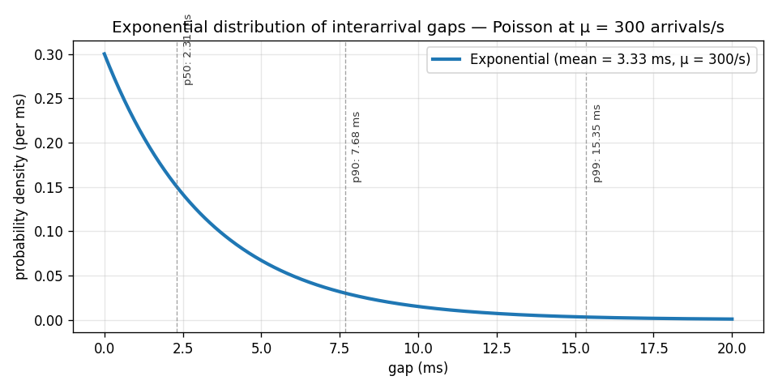
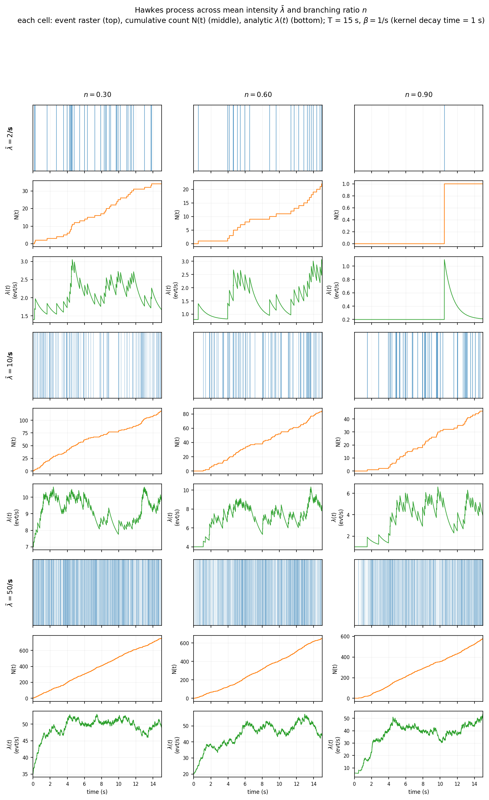
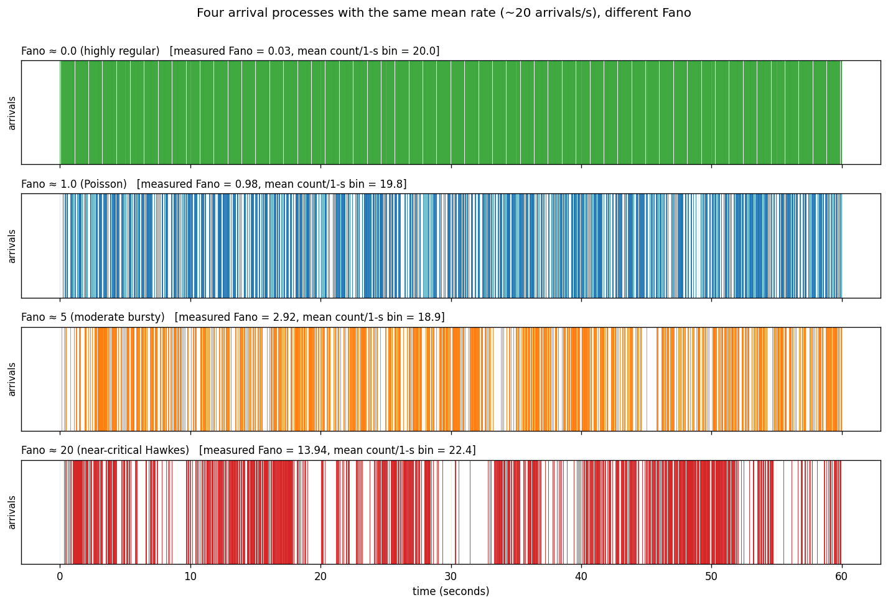
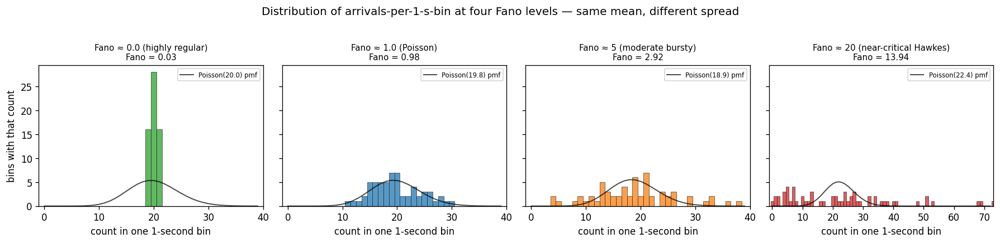
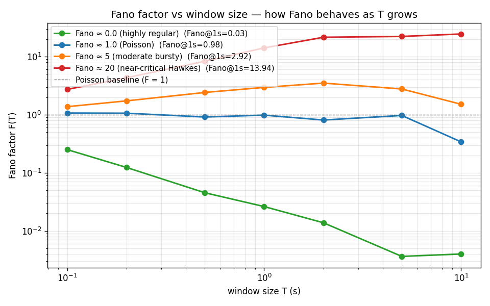

# Methodology — Hawkes Fitting and Arrival-Process Statistics

*2026-09-18 — v@m2te.ch*

*Companion draft to `outline.md`. This document supplies the fitted-model machinery for §3 of the paper.*

---

## 1. Point-process background — every term defined

This section builds the vocabulary from scratch. If you already know what a σ-algebra is you can skim to §1.4, but the paper is meant to be readable by people who don't.

### Warm-up — the Poisson process in plain English (read this first)

Before defining a "point process" formally, meet its simplest member: the Poisson process. Once you're comfortable with this, the rest of §1 is just formalising it and generalising it.

**The setup.** Imagine you're watching messages arrive from a market-data feed and you write down the time of each arrival:

```
09:30:00.213    ← 1st arrival
09:30:00.451    ← 2nd
09:30:00.802    ← 3rd
09:30:01.014    ← 4th
09:30:01.317    ← 5th
...
```

That list of timestamps is the raw thing we're going to model. Nothing else — no prices, no sides, just when.

**The Poisson idea.** Imagine that every very-tiny fraction of a second, there is some *small independent* chance an arrival happens. Independent means: whether one arrives right now doesn't depend on when the previous one came, or how many happened in the last minute, or anything about the past. It's like flipping a huge number of very-biased coins, one for each tiny sliver of time, and calling an arrival every time one comes up heads.

The **rate** of the process is a single number, usually written `λ` (Greek "lambda", for now think "rate") or `μ` ("mu"), in units of *arrivals per second*. Concretely, if the rate is 300 per second:

$$
\mu \;=\; 300 \text{ arrivals per second}
$$

then on average you get 300 arrivals per second, forever.

Three consequences that follow purely from "each tiny sliver is independent":

**(1) The time between consecutive arrivals ("gap") follows an exponential distribution with mean 1/μ.**

If `μ = 300` per second, the mean gap is:

$$
\text{mean gap} \;=\; \frac{1}{\mu} \;=\; \frac{1}{300 / \text{s}} \;\approx\; 3.3 \text{ milliseconds}
$$

The distribution of gaps has the memoryless property: no matter how long you've already been waiting, the expected time to the next arrival is still 3.3 ms.

The probability the next gap is longer than some time `Δ` is:

$$
\Pr(\text{gap} > \Delta) \;=\; e^{-\mu\,\Delta}
$$

Substituting our example rate gives:

$$
\Pr(\text{gap} > 3.3 \text{ ms}) \;=\; e^{-1} \;\approx\; 36.8\%
$$

$$
\Pr(\text{gap} > 6.6 \text{ ms}) \;=\; e^{-2} \;\approx\; 13.5\%
$$

$$
\Pr(\text{gap} > 10 \text{ ms}) \;=\; e^{-3} \;\approx\; 5.0\%
$$

Conversely, the probability the gap is *shorter* than one-tenth of the mean (i.e., less than 0.33 ms in our example) is:

$$
\Pr\!\Big(\text{gap} < \tfrac{1}{10}\,\text{mean}\Big) \;=\; 1 - e^{-0.1} \;\approx\; 9.52\%
$$

This 9.52% number appears again and again in the rest of the paper — remember it. It's the Poisson benchmark for "how often do two arrivals come nearly back-to-back". If empirical data shows 60-85% instead of 9.52%, we've definitively rejected Poisson.



*The exponential PDF of interarrival gaps for a rate-300/s Poisson process. The dashed vertical lines mark the p50 (median), p90, and p99 quantiles. Under Poisson, half the gaps are shorter than the median 2.3 ms and 10% are longer than 7.7 ms — a specific shape with a soft right tail. Real CME MDP3 data has a completely different shape: far more mass near 0 (bunched arrivals) and a much heavier right tail (long quiet stretches).*

**(2) The number of arrivals in any window of length `T` follows a `Poisson(μT)` distribution.**

Let `C` be the count of arrivals in a window of length `T`:

$$
\mathrm{E}[C] \;=\; \mu\,T
$$

$$
\mathrm{Var}[C] \;=\; \mu\,T
$$

(Same as the mean — that's the defining property of a Poisson distribution.)

So the ratio of variance to mean in *any* window `T` is:

$$
\frac{\mathrm{Var}[C]}{\mathrm{E}[C]} \;=\; 1
$$

Always. This ratio is called the **Fano factor** (§1.8 will formally define this); Poisson gives Fano = 1 at every window size. Any departure from this is a rejection of Poisson.

**(3) The number of arrivals in *disjoint* windows are independent.**

Whatever happened in `[0, 1s]` tells you nothing about how many arrivals happen in `[1s, 2s]`. No memory, no clustering, no repulsion — just independence.

**Why Poisson is the "null hypothesis" everyone starts from.** Poisson is what happens if arrivals are "as random as possible" — no self-reinforcement, no clustering, no bunching, no memory. It's what a purely mechanical, uncoordinated source would look like. Every departure from Poisson tells us something about the market: bursts of information, coordinated flow, self-reinforcing feedback.

**Two ways real market data rejects Poisson (previewing §1.7).**

- **Bunching**: real market messages tend to arrive in bursts. Many gaps are far shorter than the exponential mean would predict — in ES/NQ we see 60-85% of gaps shorter than mean/10, versus Poisson's 9.52%.
- **Momentum in the intensity**: after a burst starts, more arrivals are likely to keep coming. That's the opposite of Poisson's memoryless assumption.

To model these, we need a class of processes that is Poisson-like locally (arrivals still happen randomly on tiny timescales) but where the *rate* itself changes with the history. That's exactly what a **conditional-intensity point process** is — the topic of the rest of §1.

**Notational note.** Some authors write the Poisson rate as `λ`, others as `μ`. In this document `μ` is reserved for the *background* rate of a Hawkes process (which reduces to plain Poisson when the excitation kernel is zero), and `λ(t)` is reserved for the general time-varying conditional intensity. For a plain Poisson process, all times have the same rate:

$$
\lambda(t) \;=\; \mu \qquad \text{for all } t
$$

That constant is what we've been calling "the rate".

Now we can build up the general theory.

### 1.0 What is a "point process" and what is a "point"?

Start from the plainest words:

- **A "point"** here means a single instant in time when *something happens*. Not a spatial point (x,y), not a decimal point. Just: one instant. In our setting each point is the timestamp of one message arriving from the CME feed. If a message arrives at 09:31:15.723456789 ET, the point is that timestamp. Nothing more.

- **A "process"** is a random object that unfolds in time — you don't know it in advance, and it produces values as time goes on. A coin flipped once is random but static; a stock price ticking through the day is a random *process*. In our case the process produces a random *list of arrival timestamps*: `t₁, t₂, t₃, ...`

Putting the two words together:

- **A "point process"** is a random sequence of points (timestamps) on the real line. It is fully specified by *when* events happen — not by any value attached to those events. The output of a point process is nothing but a set of timestamps.

If each event *also* carries additional information (side, price, size), that's a **marked point process** — the timestamps are the "points" and the additional info per event is called a **mark**. Our arrival streams are naturally marked (each MBO message has side/price/size), but for arrival-process characterization (§3, §5) we mostly ignore the marks and treat only the timestamps as the process.

Alternative names you may see in the literature: "counting process" (emphasises `N(t)`), "temporal point process" (distinguishes from spatial), "renewal process" (a specific subclass — §1.5b), "self-exciting process" (Hawkes — §1.5c). All describe the same class of random-timestamps-in-time object under different assumptions.

**Concrete example.** Between 09:30:00 and 09:30:01 of NQ March-2025 the following four MBO arrivals occur, with timestamps:

```
09:30:00.001234567   Add,  bid 21432.50, size 3
09:30:00.001234571   Add,  ask 21432.75, size 5
09:30:00.017891234   Cancel, order X, bid 21432.25
09:30:00.238491702   Trade, ask 21432.75, size 2
```

The **point process** is just the four timestamps. The **marks** (Add/Cancel/Trade, side, price, size) are additional per-event data. Our theory in §1.1-1.9 is about the timestamps only.

### 1.1 The setup — a probability space

We model market-data arrivals as a **stochastic process**: a family of random variables indexed by time. The underlying machinery is a **probability space** `(Ω, F, Pr)`:

- **`Ω`** ("sample space") — the set of all possible *outcomes* of the whole experiment. Here an outcome is one specific realization of the market's day: the complete list of arrival timestamps, prices, sides, etc. Different days of trading are different outcomes drawn from `Ω`. You never see `Ω` directly; it exists to make everything else well-defined.

- **`F`** ("sigma-algebra" of events, written `Σ` or `F`, pronounced "the σ-algebra"). Plain English:

  Think of a σ-algebra as the **exhaustive list of yes-or-no questions we're allowed to ask about the outcome of the experiment**, and to which a probability can be assigned. Each such question corresponds to a subset of `Ω` — the subset of outcomes for which the answer is "yes". Two examples:

  - Question: "Did at least one message arrive between 09:30:00 and 09:30:01?" → yes/no. The subset of `Ω` where the answer is yes is one event, an element of `F`.
  - Question: "Did the front contract trade above 21500 at some point in the day?" → yes/no. Another event.

  So an "event" is nothing more mysterious than a yes-or-no question about what happened, and `F` is the complete catalog of such questions.

  The two rules a σ-algebra must satisfy just say the catalog is closed under logical combinations:

  1. **Closed under complements.** If "did A happen?" is in the catalog, then "did A *not* happen?" is also in the catalog. (You can always negate a yes/no question.)
  2. **Closed under countable unions.** If you have a list of questions `A₁, A₂, A₃, ...` in the catalog, then "did *at least one* of `A₁, A₂, A₃, ...` happen?" is also in the catalog. (You can OR any countable list of questions together.)

  From those two rules follow all the usual set-theoretic operations: intersections (AND), differences, symmetric differences. So the σ-algebra ends up being every yes/no question you could logically build out of the elementary ones.

  Why is this needed? Because for some sample spaces (uncountably infinite ones like ours) you can't consistently assign probabilities to *every* possible subset of `Ω` — that would break the math. The σ-algebra picks out the "nice" subsets where probability *is* well-defined. In practice for our arrival-timestamp setting, `F` is the standard **Borel σ-algebra** — the natural catalog of yes/no questions on the real line (or on the space of arrival-time lists), generated by the simplest ones like "is the timestamp less than τ?" and closed under negation and countable union as usual — and every event you'd naturally think of ("at least N arrivals in this window", "the k-th arrival was before time τ") lives in it.

  For a small everyday analogy: if `Ω` = {all possible outcomes of a coin flip} = {H, T}, then `F` = { ∅, {H}, {T}, {H,T} } — the four questions "did nothing happen", "was it heads", "was it tails", "was it either" — and each has a probability. That's a σ-algebra. Ours is much bigger but the idea is the same: a complete catalog of yes/no questions closed under negation and countable-OR.

- **`Pr`** (probability measure, sometimes written `P`) — a function that assigns a probability to each event:

  $$
  \Pr : \mathcal{F} \to [0, 1]
  $$

  Takes an event (a subset of `Ω`) and returns a real number in `[0, 1]`. The three axioms are:

  $$
  \Pr(\emptyset) \;=\; 0
  $$

  $$
  \Pr(\Omega) \;=\; 1
  $$

  and countably additive for disjoint events (probabilities of disjoint alternatives sum). Every time you see `Pr(...)` below, read it as "the probability of the event inside the parentheses".

### 1.2 Filtration — how information accumulates over time

At time `t = 0` we know nothing yet. As time passes we observe more arrivals. To formalize this we introduce a **filtration**: an increasing family of σ-algebras indexed by time, with each earlier σ-algebra sitting inside every later one:

$$
\{\mathcal{F}_t\}_{t \geq 0} \qquad\text{with}\qquad \mathcal{F}_s \subset \mathcal{F}_t \quad\text{for all } s \leq t
$$

- **`𝓕ₜ`** — the σ-algebra of everything observable by time `t` (inclusive). If an event is "the third arrival happened at 09:31:15.723", then this event is in `𝓕ₜ` for every `t ≥ 09:31:15.723` (we know it after 9:31:15.723) and not in `𝓕ₜ` for earlier `t` (we don't know it yet).

- **`𝓕ₜ₋`** — everything observable *strictly before* `t`. This distinction matters because whether an arrival happens exactly at time `t` may or may not be included: `𝓕ₜ₋` is the history right up to `t`, exclusive of what happens at `t` itself.

So when a formula says "conditional on `𝓕ₜ₋`", it means "given everything we've seen strictly before time `t`". A **process is adapted to `{𝓕ₜ}`** if for every `t` its value is measurable with respect to `𝓕ₜ` — i.e., knowable from the history up to `t`.

### 1.3 The counting process N(t)

The observable object is a random function of time:

$$
N(t) \;=\; \#\{\, i : t_i \leq t \,\}
$$

- `t₁, t₂, ...` are the (random) arrival times of the point process
- `#{ ... }` means "how many"
- `N(t)` is thus "how many arrivals we've seen by time `t` inclusive"

`N(t)` is a non-decreasing, right-continuous, step-function of `t` that jumps by 1 at each arrival. It starts at zero:

$$
N(0) \;=\; 0
$$

For a fixed `t`, `N(t)` is a random *number* (integer ≥ 0). Varying `t`, `N(·)` is a random *function*. The whole point of point-process theory is to model the *law* of `N(·)`.

Number of arrivals in a half-open interval:

$$
N(t + h) - N(t) \;=\; \text{number of arrivals in } (t,\, t + h]
$$

### 1.4 Conditional intensity — the "current speed" of the process

**The plain-English version first.** At any moment `t`, ask two questions:

1. "What's the probability that at least one new message arrives in the next tiny sliver of time, of length `h` seconds?"
2. "Given all the messages we've already seen up until right now (but not including `t` itself), how does that probability behave as `h` gets very small?"

The **conditional intensity** `λ(t)` is the answer to question 2, divided by `h`, in the limit as `h → 0`. It's the *instantaneous rate* of arrivals at time `t`, conditional on the history so far. If the current rate is 300 per second, then in the next 1 ms the chance of seeing a message is roughly:

$$
\Pr(\text{arrival in the next 1 ms}) \;\approx\; \lambda(t) \cdot h \;=\; 300 \times 0.001 \;=\; 30\%
$$

**The formula.** Written out in symbols this is:

$$
\lambda(t \mid \mathcal{F}_{t^-}) \;=\; \lim_{h \downarrow 0} \frac{1}{h} \; \mathrm{Pr}\!\left(\; \underbrace{N(t+h) - N(t)}_{\substack{\text{number of arrivals}\\\text{in the tiny interval }(t,\,t+h]}} \;\geq\; 1 \;\;\Big|\;\; \underbrace{\mathcal{F}_{t^-}}_{\substack{\text{everything we've}\\\text{observed strictly}\\\text{before time }t}} \;\right)
$$

Piece by piece:

- **`Pr(A | B)`** — read as "the probability of A given B". It's just conditional probability, the same one you saw in grade 12. `Pr(rain | cloudy)` = probability of rain given it's cloudy.
- **`A` = "`N(t+h) − N(t) ≥ 1`"** — the event *"at least one message arrived between `t` and `t+h`"*. `N(t)` was defined as "how many arrivals we've counted so far", so the difference is "how many new ones showed up in that tiny interval". Requiring ≥ 1 just means "at least one".
- **`B` = "`𝓕ₜ₋`"** — the whole history strictly before `t`. All the messages we've already observed, their times, their sides, everything. Formally a σ-algebra; informally "the past."

So the raw probability inside the formula is:

> **"The probability that at least one new message arrives in the next `h` seconds, given the entire history of messages that arrived strictly before now."**

That probability is a number in `[0,1]`. As you shrink `h → 0`, the probability shrinks too (there's less time for something to happen). To get a *rate* (per second) instead of a probability (dimensionless), we divide by `h`. The limit as `h → 0` gives us `λ(t)`, which has units of "arrivals per second".

**Why "conditional".** The rate depends on what came before. If a big burst just happened, `λ(t)` should be temporarily higher (the market is active). If the last message was 2 minutes ago, `λ(t)` might be lower. The conditioning bar `| 𝓕ₜ₋` is what allows the rate to depend on history.

**Contrast with unconditional (Poisson, defined properly in §1.5).** If the intensity equals some constant — call that constant `μ` (Greek "mu", introduced formally in §1.5(a)) — no matter what came before, that's Poisson:

$$
\lambda(t) \;=\; \mu \qquad (\text{Poisson})
$$

`μ` here is just "the background arrival rate", with units 1/time (arrivals per second). If it equals 300, we expect 300 arrivals per second on average, and the history doesn't change that. The conditioning bar `| 𝓕ₜ₋` in the intensity formula carries no information for Poisson because whatever happened before, `λ(t) = μ` anyway.

**Contrast with Hawkes (also defined properly in §1.5).** In a Hawkes process the intensity is that same background `μ` (still the exogenous "would happen anyway" rate, per second) **plus** a sum over all *past* arrival times (those in `𝓕ₜ₋`) of a decaying "excitation" contribution `φ(t − tᵢ)`:

$$
\lambda(t) \;=\; \mu \;+\; \sum_{t_i \,<\, t} \phi(t - t_i) \qquad (\text{Hawkes, preview})
$$

where `tᵢ` is a past arrival and `φ` is a decay function called the kernel. Each past event bumps `λ(t)` up, and the bump decays as time since that event grows. Full formulas below.

**Useful shortcuts** for small `h`, informal:

Probability of an arrival in the next small interval:

$$
\Pr(\text{arrival in }(t,\,t+h]) \;\approx\; \lambda(t)\,h
$$

Expected number of arrivals in a finite interval:

$$
\mathrm{E}\!\left[\,N(b) - N(a)\,\right] \;\approx\; \int_a^b \lambda(s)\, ds
$$

Once we've said what `λ(·)` is (as a function of history), we've said everything about the point process. Different families of `λ` give different models:

### 1.5 Three canonical models

**(a) Homogeneous Poisson.** Constant intensity:

$$
\lambda(t) \;=\; \mu \qquad \mu > 0
$$

- `μ` = the constant background rate (per second). If it's 300, we expect 300 arrivals per second on average, forever.
- Gaps between consecutive arrivals are **i.i.d.** ("independent and identically distributed" — each gap is drawn independently of the others, from the same distribution) and exponential:

$$
t_{i+1} - t_i \;\sim\; \mathrm{Exp}(\mu), \qquad \text{mean gap } = 1/\mu
$$

- Count in any window `[t, t + T]` is Poisson-distributed:

$$
N(t + T) - N(t) \;\sim\; \mathrm{Poisson}(\mu T), \qquad \mathrm{E}[\cdot] = \mathrm{Var}[\cdot] = \mu T
$$

- Every summary statistic we compute reduces to a triviality here. Let `Δ` denote a random interarrival gap. Then:

$$
\text{CV} \;=\; \frac{\sigma(\Delta)}{\mathrm{E}[\Delta]} \;=\; 1 \qquad (\text{coefficient of variation, formally defined in §5.1})
$$

$$
\text{CV}^2 \;=\; \left(\frac{\sigma(\Delta)}{\mathrm{E}[\Delta]}\right)^2 \;=\; 1
$$

$$
F(T) \;=\; 1 \qquad (\text{Fano factor at every window } T\text{; §1.8})
$$

$$
H \;=\; 0.5 \qquad (\text{Hurst exponent; §1.9})
$$

$$
\mathrm{Corr}(\Delta_i, \Delta_{i+k}) \;=\; 0 \qquad (\text{gap autocorrelation at every lag } k)
$$

All these quantities are ways of measuring departure from this baseline.
- This is the null hypothesis every microstructure paper rejects, and we reject it too — but reporting *how much* it's rejected is the ballgame.

**(b) Renewal process.** Interarrival gaps are defined as:

$$
\Delta_i \;=\; t_i - t_{i-1}
$$

They are drawn i.i.d. from some common distribution `G`, not necessarily exponential. (We use `G` rather than `F` for the gap distribution to avoid clash with the σ-algebra `F`.)

Intensity is a function of time since the last arrival:

$$
\lambda(t) \;=\; h(t - t_{\mathrm{last}})
$$

- `t_last` = the last arrival time up to `t`.
- `h(·)` = the **hazard function** of `G`, i.e., the rate at which the next event fires given none has fired yet since `t_last`. For an exponential gap distribution the hazard is constant:

$$
h(u) \;=\; \mu \qquad (\text{if } G = \mathrm{Exp}(\mu))
$$

For other `G` the hazard varies with the elapsed time.

- Marginal distribution of gaps can be arbitrary (heavy-tailed, bi-modal, anything). But **consecutive gaps are independent** by construction.
- Renewal ≠ Poisson unless `G` is exponential.
- Renewal produces high CV (the coefficient of variation introduced above under §1.5a) — defined:

$$
\mathrm{CV} \;=\; \frac{\sigma(\Delta)}{\mathrm{E}[\Delta]}
$$

and high Fano at short `T` — but not sustained clustering over time. Shuffling the gap sequence — using the **Fisher-Yates shuffle**, a standard uniformly-random permutation algorithm (imagine dealing the gaps into a random order like shuffling a deck of cards) — leaves the renewal process statistically identical (i.i.d. under permutation). This is why the Fisher-Yates shuffle test (§5.3) separates renewal from Hawkes: under Hawkes the ordering matters, so shuffling changes the statistics; under renewal the ordering doesn't matter, so shuffling changes nothing.

**(c) Hawkes (self-exciting) process.** Each past arrival transiently raises the intensity of subsequent arrivals:

$$
\lambda(t) \;=\; \mu \;+\; \sum_{t_i \,<\, t} \phi(t - t_i)
$$

- **`μ ≥ 0`** — the **background rate**, the intensity that would exist with zero prior arrivals. "Exogenous" arrivals (news, order-flow uncorrelated with prior events).
- **`φ : (0, ∞) → [0, ∞)`** — the **kernel** (or "excitation function"). Given that an arrival happened `u` seconds ago, `φ(u)` is how much extra intensity that arrival still contributes right now. `φ` decays: recent arrivals contribute more than old ones.

  **What "kernel" means in plain English.** The word "kernel" here has nothing to do with corn or operating systems — it's a math-jargon term for a function that says *"how much a past event still matters at any later time"*. Two everyday metaphors:

  - **Ripples in a pond.** Drop a stone in still water. It creates a ripple that spreads and fades. The kernel is the shape of that fading — big right after the drop, small a few seconds later, zero after long enough. If you drop several stones at different times, the total disturbance at any moment is the sum of the individual ripples still going, each faded by the amount of time since its stone hit.
  - **A bell ringing.** Strike a bell; it rings loudly at first, then decays. The kernel is the decay curve of one strike's sound. If someone hits the bell many times, the total sound right now is the sum of all past strikes, each contributing according to how long ago it was hit.

  In a Hawkes process, every past arrival `tᵢ` is one such "stone drop" or "bell strike". The intensity `λ(t)` right now is the background rate `μ` plus the sum of the *residual echoes* from every past arrival, where the kernel `φ(t − tᵢ)` tells you how loud each echo still is:

  $$
  \lambda(t) \;=\; \underbrace{\mu}_{\text{background}} \;+\; \underbrace{\sum_{t_i \,<\, t} \phi(t - t_i)}_{\substack{\text{sum of residual echoes} \\ \text{from all past arrivals}}}
  $$

  So the kernel is the *shape* of one event's future influence. Two things follow:

  1. **`φ` must decay** as `u` grows — otherwise past events would matter forever, and the process would build up to infinity. Formal condition: the kernel is integrable, i.e., its total area `n = ∫φ` is finite (this integral is the branching ratio from §1.6).
  2. **`φ` must be non-negative** — a past event can only *raise* future intensity in a self-exciting model, never lower it. (Models with negative excitation exist — "self-inhibiting" processes — but they don't fit CME data and we don't use them.)

  Different choices of kernel shape produce different Hawkes flavors. The most common two we fit:

- **`tᵢ`** — the past arrival times (all events with `tᵢ < t`; the sum runs over all of them).

Two standard kernel families:

**Exponential kernel:**

$$
\phi(u) \;=\; \alpha\, e^{-\beta\, u}
$$

Two parameters: `α ≥ 0` is the jump-size (intensity increment immediately after an arrival), `β > 0` is the decay rate (1/time-constant). This is what we fit primarily. Its virtue: **Markovian** — the current intensity summarizes all the information you need from the past, so you only need to update one running number when a new event arrives, rather than re-scanning history. Named after mathematician A. A. Markov. Concretely for the exp-Hawkes, if the current intensity right before a new event is `λ(t)`, then right after that event it becomes `λ(t) + α`, and between events it decays as `μ + (λ(t) − μ)·exp(−β·Δt)`. Nothing else about the past enters. This means intensity updates recursively in `O(1)` per new arrival.

**Power-law kernel:**

$$
\phi(u) \;=\; a \, (u + c)^{-(1+p)} \qquad p > 0
$$

Slower decay; consistent with the empirical Hardiman-Bouchaud finding that CME kernels look power-law over long horizons. Slower to fit; considered in §5 goodness-of-fit follow-up.

### 1.6 Branching ratio n — the most important derived quantity

$$
n \;=\; \int_0^\infty \phi(u)\, du
$$

- `n` = **mean number of direct "offspring" arrivals that a single arrival triggers over its remaining kernel**.
- For the exponential kernel:

$$
n \;=\; \int_0^\infty \alpha\, e^{-\beta u}\, du \;=\; \frac{\alpha}{\beta}
$$

That's a two-line calculation you can do by hand.

- For a general kernel, integrate `φ` over all future time.

Interpretation as a **branching process** (also called a Galton-Watson process, after the 19th-century statisticians who first studied family-surname extinction with it):

Think of each arrival as an "ancestor" that may produce some random number of "offspring" arrivals directly. Those offspring can then produce their own offspring, and so on. The branching ratio `n` is the average number of direct offspring per ancestor. Whether the whole family line dies out or grows to infinity depends entirely on whether `n < 1` or `n ≥ 1`:

- Every arrival is either **exogenous** (spawned by the background `μ`) or **endogenous** (a "child" of some earlier arrival).
- On average each arrival has `n` direct children.
- Expected total cluster size initiated by one exogenous arrival is a geometric series:

$$
\text{expected cluster size} \;=\; 1 + n + n^2 + n^3 + \ldots \;=\; \frac{1}{1 - n} \qquad (\text{for } n < 1)
$$

- When `n < 1` the process is **subcritical / stationary**: expected clusters are finite; the process has a stationary rate:

$$
\text{stationary rate} \;=\; \frac{\mu}{1 - n}
$$

- When `n → 1⁻` the process is **near-critical**: cluster sizes and durations diverge; long-range dependence appears (rough volatility literature builds on this).
- When `n ≥ 1` the process is **supercritical**: with positive probability a single arrival spawns an infinite cascade in finite time, which we don't observe in nature.

Empirically on ES/NQ book feeds the branching ratio sits in a narrow window near 1:

$$
n \;\approx\; 0.85 \text{ to } 0.97 \qquad (\text{ES/NQ, prior literature})
$$

That's the "close to critical" story from Filimonov-Sornette and Hardiman-Bouchaud that we replicate and extend.

### 1.6a Visualising the two knobs — what "branching" and "intensity" actually look like

Two Hawkes fits with the same branching ratio but different mean intensity look completely different in an event raster, and same-intensity but different-branching fits look completely different too. Since these are the two knobs the paper stratifies markouts by, spend a minute looking at how they trade off visually.

We simulate an exponential Hawkes on a fixed 60-second window at each of nine $(\bar\lambda, n)$ combinations — the 3×3 factorial of $\bar\lambda \in \{2, 10, 50\}$ events/s and $n \in \{0.30, 0.60, 0.90\}$. For each cell we show:

1. **Event raster** — every arrival as a vertical tick on a 60-second axis. Reveals visible clustering.
2. **Count curve $N(t)$** — cumulative event count on the same axis. Steeper stretches = bursts.
3. **Intensity trace $\lambda(t)$** — the underlying Hawkes intensity computed from the simulation. Peaks after clusters, decays during quiet stretches.

**What you should see across the panels:**

- **Low $\bar\lambda$, low $n$ ($\bar\lambda=2$, $n=0.30$).** Nearly Poissonian — event ticks look uniformly random, count curve is nearly a straight line, intensity trace hugs the mean with tiny wiggles. Two events per second, no clustering.

- **High $\bar\lambda$, low $n$ ($\bar\lambda=50$, $n=0.30$).** Dense but still nearly Poissonian — 50 events per second on average, ticks packed together but distributed evenly, count curve steep and straight, intensity trace roughly constant. Busy without being bursty.

- **Low $\bar\lambda$, high $n$ ($\bar\lambda=2$, $n=0.90$).** The most instructive cell for the paper. Mean rate is only 2/s but arrivals come in unmistakable bursts — long empty stretches punctuated by rapid clusters. The intensity trace spikes hard during bursts (up to 20-30 events/s locally) and drifts back to near zero between them. Same mean intensity as the top-left cell but shape is completely different.

- **High $\bar\lambda$, high $n$ ($\bar\lambda=50$, $n=0.90$).** Chaotic — dense arrivals AND strong clustering. The intensity trace swings from ~20/s to ~200/s within the same session. This is what near-critical high-traffic hours (open, close, macro release) actually look like on the CME.

**Why the visualization matters for the paper.** The empirical panel we build (per-30-min window across 730 sessions × 3 streams) samples this 2-D plane at every point. If tail thickness correlated only with $\bar\lambda$, the top-right cell would be the worst-tail cell. If tail thickness correlated only with $n$, the bottom-left cell would tie with the bottom-right. The correlations we report in §5.6 tell us which of those two stories the data actually says.

**What happens at $n = 1$ and beyond — the critical boundary.**

The three cells shown (n = 0.30 / 0.60 / 0.90) are all **subcritical**: each event fires on average $n < 1$ future events through its exponential kernel, the cascade dies out, and the long-run mean intensity $\bar\lambda = \mu / (1 - n)$ is finite. As $n \uparrow 1$ that denominator collapses and $\bar\lambda$ blows up — you can already see it in the third column: at n = 0.90, the same $\mu$ that produced ~2 events/s at n = 0.30 now produces bursts an order of magnitude larger, because each burst breeds ~9 follow-ons on average before dying.

- **$n = 1$ exactly** is the **critical** point. The formula $\bar\lambda = \mu / (1 - n)$ diverges. On any finite time window the process is still well-defined and fires finitely often, but the counts don't stabilise — the variance of $N(T)$ grows superlinearly with $T$ (versus linearly for $n < 1$ and for Poisson). This is the boundary between "damped self-exciting" and "explosive" regimes and the theoretical target of the Filimonov-Sornette / Hardiman-Bouchaud claim that liquid futures sit *just* below it.

- **$n > 1$ is supercritical**: each event fires more than one child on average, so the cascade explodes exponentially and the model diverges in finite time. This is not a regime one observes in fitted markets — a well-behaved MLE on real data never returns $n > 1$ on a stable session. If a fit lands there it's a sign of estimator instability, non-stationarity across the fit window, or a mis-specified kernel, not a real property of the arrivals. Our optimizer constrains $\alpha < \beta$ (equivalently $n < 1$) at the boundary and reports fits that hit the boundary as unreliable.

- **What "close to critical" means empirically.** Filimonov-Sornette report $n_\text{day} \approx 0.85$–$0.95$ on ES over the 2000s–2010s. Our own pilot on NQH5 2025-03-10 lands at $n = 0.90$ — consistent with the "near-critical but stable" regime. The paper's per-session distributions of $n$ across the corpus test whether that near-criticality is a stable property of these markets or drifts with regime.



**Figure.** `figs/hawkes_grid_3x3.png` — 9 cells, each stacking the event raster (top), cumulative count $N(t)$ (middle), and analytic $\lambda(t)$ (bottom). Rows are mean intensity $\bar\lambda \in \{2, 10, 50\}$ events/s; columns are branching ratio $n \in \{0.30, 0.60, 0.90\}$. Simulated by Ogata thinning over 15 s at $\beta = 1$/s (so the excitation kernel decays on a 1-second timescale in every cell). Generator: `arrival_paper/make_hawkes_grid.py` (RNG seed pinned per cell for reproducibility).

### 1.7 Why Hawkes captures CME MDP3 and Poisson doesn't

Three data signatures that a Poisson (or any renewal process) cannot produce, but a Hawkes with `n` close to 1 produces naturally:

**(i) Very short interarrival gaps.** Empirically, on ES/NQ book streams roughly 60-85% of gaps are shorter than one-tenth of the mean gap. For any exponential the corresponding number is fixed:

$$
\Pr\!\Big(\text{gap} < \tfrac{1}{10}\,\text{mean}\Big) \;=\; 1 - e^{-0.1} \;\approx\; 9.52\% \qquad (\text{any exponential})
$$

Hawkes produces the excess of short gaps because each arrival transiently raises `λ`, making the next arrival more likely to come soon.

**(ii) Positive gap autocorrelation.** For a Hawkes process the autocorrelation of consecutive gaps is positive at every lag:

$$
\mathrm{Corr}(\Delta_i, \Delta_{i+k}) \;>\; 0 \qquad \text{for all lags } k
$$

Long gaps cluster with long gaps (quiet periods), short with short (bursty periods). Renewal processes have i.i.d. gaps by definition, so:

$$
\mathrm{Corr}(\Delta_i, \Delta_{i+k}) \;=\; 0 \qquad (\text{renewal, any } k \geq 1)
$$

Only self-excitation can produce positive lag-`k` gap correlation.

**(iii) Persistent burstiness across timescales.** The Fano factor (defined in §1.8 next) rises with the window size `T` on a Hawkes process; on Poisson or any renewal it stays constant. This means clustering isn't a single-timescale phenomenon — it looks self-similar over decades of `T`.

### 1.8 Fano factor — measuring dispersion of counts

For a chosen window length `T`, chop the observation interval `[0, τ_end]` into `K` disjoint bins:

$$
K \;=\; \lfloor \tau_{\mathrm{end}} / T \rfloor
$$

Count arrivals in each bin:

$$
C_k \;=\; N(kT) - N((k-1)T) \qquad k = 1, 2, \ldots, K
$$

Then the Fano factor at window `T` is the sample variance divided by the sample mean of those counts:

$$
F(T) \;=\; \frac{\mathrm{Var}[C_k]}{\mathrm{E}[C_k]}
$$

- Units: dimensionless (variance of a count / mean of a count).
- **Poisson:** variance equals mean at every window, so:

$$
F(T) \;=\; 1 \qquad \text{for every } T \text{ under Poisson}
$$

This is the definitive Poisson signature.

- **Hawkes / clustered:** `F(T) > 1`, and typically `F(T)` grows with `T` because clustering compounds over longer windows.
- **Renewal:** `F(T) → 1` as `T → ∞` (windows contain many i.i.d. gaps and the **Central Limit Theorem**, or CLT — the classic result that averaging many independent things gives a Gaussian bell-curve — kicks in, so the count in a large window looks approximately Gaussian with variance ≈ mean). Renewal can have large `F(T)` at short `T` but `F(T)` stabilizes at large `T`. So *rising* Fano at large `T` is a Hawkes signature, not just a renewal signature.

Origin: Fano (1947) in cosmic-ray physics — same problem, counts of independent events in fixed windows.

**What Fano does visually — same mean rate, four different processes.** All four rows below have the same average rate (~20 arrivals per second), but the *dispersion* of arrivals inside 1-second windows differs by orders of magnitude:



*Top row (F ≈ 0, highly regular): arrivals march at a near-lattice cadence — every 50 ms like clockwork. Bins all have roughly the same count.*
*Second row (F ≈ 1, Poisson): the reference. Arrivals look "randomly spread" — no big gaps, no big bunches, mildly uneven bin counts.*
*Third row (F ≈ 3, moderate Hawkes): visible clumping. Some bins have 30-40 arrivals, some 5-10. You can see the flow "breathing".*
*Bottom row (F ≈ 14, near-critical Hawkes): pronounced bursts and long quiet stretches. Bin counts range from near-zero to 50+.*

**The same picture as a histogram of counts per 1-s bin:**



*Each panel shows the empirical distribution of arrivals per 1-second bin (colored bars) with the theoretical Poisson pmf at the same mean overlaid as a black curve.*

- **F ≈ 0 (regular):** all bins have counts crowded around the mean; distribution is much *narrower* than Poisson. Sub-Poisson.
- **F ≈ 1 (Poisson):** empirical histogram matches the Poisson pmf almost exactly. Reference case.
- **F > 1 (bursty):** distribution is *wider* than Poisson at the same mean — extra mass in both tails. Some bins are near-empty, some are packed. This is what CME MDP3 looks like — but shifted much further to the right (F(1s) empirically 10-70 on ES/NQ MBO adds).

So *Fano visualises the "shape" of arrivals*: below 1 = too regular to be Poisson (rare in market data), = 1 = Poisson-random, > 1 = bunched. The higher the Fano, the more the arrivals cluster into bursts separated by quiet gaps.

### 1.9 Hurst exponent — how burstiness scales with timescale

For a Hawkes-like process near criticality, the Fano factor scales as a power law in the window size:

$$
F(T) \;\sim\; T^{\, 2H - 1}
$$

where `H` (Hurst exponent) is a number:

$$
H \;\in\; [0.5, 1)
$$

- **`H = 0.5`** — no long-range dependence. Poisson, or any renewal process. `F(T)` is asymptotically constant.
- **`H > 0.5`** — long-range dependence, self-similar clustering across timescales. This is what Hawkes produces near criticality.
- **`H → 1`** — extreme long-memory; each timescale looks like a scaled version of the next.

We estimate `H` empirically by regressing log-Fano on log-window in OLS (**ordinary least squares** — the standard best-fit-line procedure that picks the line minimizing the sum of squared vertical distances between the fitted line and the observed points):

$$
\log F(T) \;=\; (2H - 1)\,\log T \;+\; c \;+\; \varepsilon
$$

The fitted slope equals `2H − 1`, and Hurst is recovered by:

$$
H \;=\; \frac{\text{slope} + 1}{2}
$$

For CME book feeds we typically observe:

$$
H \;\in\; [0.65, 0.75] \qquad (\text{empirical, ES/NQ book feeds})
$$

Higher `H` means more persistent clustering.

**Fano scales differently with window size for each process:**



*Log-log plot of F(T) vs the window size T for the four simulated processes.*

- **Regular (green)**: F(T) stays near zero — the process is nearly deterministic, so bin counts have vanishing variance at every T.
- **Poisson (blue)**: F(T) sticks close to 1 at every T, exactly as theory predicts. That flat horizontal line at F = 1 is the Poisson signature.
- **Moderate Hawkes (orange)**: F(T) is > 1 and rises with T because clustering compounds over longer windows.
- **Near-critical Hawkes (red)**: F(T) rises steeply — larger windows see bigger and bigger bursts because clusters last longer.

The *slope* of the log-log curves gives you the Hurst exponent H. Flat slopes (0) correspond to H = 0.5. Rising slopes correspond to H > 0.5 — the near-critical Hawkes in the red curve has a slope of roughly 0.5, which corresponds to H ≈ 0.75.

Note: shuffling the gap sequence (Fisher-Yates permutation) preserves the marginal distribution of gaps exactly but destroys the ordering, thereby destroying any long-range dependence. Under shuffle:

$$
H_{\mathrm{shuffled}} \;\to\; 0.5
$$

This is our sharpest test for whether clustering lives in the *ordering* (Hawkes) or in the *marginal* (renewal).

### 1.10 Notational summary

| symbol | meaning |
|---|---|
| `Ω` | sample space of all possible market days |
| `F` | σ-algebra of events (subsets of Ω we can assign probabilities to) |
| `Pr(A)` or `P(A)` | probability of event `A ∈ F`, a number in `[0,1]` |
| `𝓕ₜ` | σ-algebra of everything observable by time `t` (inclusive) |
| `𝓕ₜ₋` | σ-algebra of everything observable strictly before `t` |
| `t₁, t₂, ...` | random arrival times (finite in any bounded window) |
| `N(t)` | counting process: number of arrivals with `tᵢ ≤ t` |
| `λ(t)` or `λ(t \| 𝓕ₜ₋)` | conditional intensity at `t` given history before `t`, units 1/time |
| `μ` | Hawkes background rate — intensity with zero prior arrivals |
| `φ(u)` | Hawkes kernel — extra intensity a single event contributes `u` seconds later |
| `α` | exponential-kernel jump size (intensity increment immediately after an arrival) |
| `β` | exponential-kernel decay rate (1/time-constant); half-life `= ln 2 / β` |
| `γ` | marked-Hawkes size exponent — how much larger events excite more |
| `n = ∫φ` | branching ratio; for exponential kernel `n = α/β` |
| `Δᵢ = tᵢ − tᵢ₋₁` | interarrival gap |
| `Cₖ` | number of arrivals in bin `k` under some window `T` |
| `F(T)` | Fano factor = Var[Cₖ] / E[Cₖ] |
| `H` | Hurst exponent — Fano slope in log-log, `F(T) ~ T^{2H-1}` |
| `uᵢ` | compensator increment (`∫_{tᵢ₋₁}^{tᵢ} λ ds`) — "how many events the fitted model expected between these two consecutive events". Used in the time-rescaling GOF (goodness-of-fit) test in §5.5. |

## 2. Data — what we compute from and where it lives

**Corpus:** CME MDP3 pre-decoded L3 record files (`.bin`) for ES (chan 310), NQ (chan 318), and BTC (chan 326, extraction in flight for 2025). Path: `/vast/home/vmayeski/out/bin/{chan}/{chan}.{yyyymmdd}.databento.bin`. Each record carries three ns-precision timestamps that we use throughout the paper:

- **`transactTime`** — CME matching engine event time. The *true* arrival of the market event, stamped by CME's core matching engine and carried unchanged inside the MDP3 message body. This is the "physical" event time — the moment the trade or book update actually happened at the exchange.

- **`sendingTime`** — CME gateway UDP packet header time. Stamped by CME's outbound gateway when it packages one or more matching-engine events into a UDP packet for multicast. The difference `sendingTime − transactTime` therefore measures **CME-internal gateway queueing** — how long the event sat inside CME's own infrastructure between happening and being broadcast.

- **`recv_time`** (on trades) / **`handlerendtim`** (on MBO records) — **the pcap wire-arrival timestamp at Databento's colo capture tap.** Not our own capture — Databento captures pcaps in their CME-colo, stamps each UDP frame with the NIC-arrival time, and ships those pcaps to us. When we run `dbento_pcap_to_bin` on those pcaps, `handler_if.hpp` copies the pcap frame timestamp directly into the `.bin` record's `handlerendtim` field on MBO messages and into `recv_time` on trade messages (verified at `mdp3/include/mdp3/handler_if.hpp:577,691,771,832` — `l3.handlerendtim = recv_time` unconditionally in the offline path). The field name "handlerendtim" is a misnomer inherited from the live-handler code path; in the historical corpus it functions as the pcap wire timestamp. The difference `handlerendtim − sendingTime` therefore measures **CME-multicast transit to Databento's colo tap** — a network-only latency, cleanly separated from CME-internal queueing.

**Important limitation.** The three-timestamp anatomy uses Databento's colo capture time, not our own capture time. So the `handlerendtim − sendingTime` distribution characterises the CME → Databento colo path, which is a stable colo-cross-connect path but is not literally the network we would see if we captured elsewhere. For the arrival-process characterisation (§3) this doesn't matter — the *ordering* and *clustering* of arrivals is invariant to any small fixed offset. For any latency-magnitude claim we call this out explicitly.

**Field-name gotcha.** Older `handler_if` code paths (live handlers) do write a genuine "handler finished processing" timestamp into `handlerendtim`. In the historical pcap pipeline we use, that same field is repurposed to carry the pcap wire timestamp. This is confusing, but it's what the code does — and it's what makes the three-timestamp analysis possible for MBO records (which otherwise have no dedicated `recv_time` field in the current `.bin` schema).

**Restriction to one front contract per session.** For the arrival-process analysis, we track only the front-month futures securityID (highest MBO Adds count in the day, from `binstats`). This isolates the flow that carries the price-forming information. Roll days are dropped (front may straddle two contracts).

**Restriction to RTH.** 09:30 → 16:00 ET (14:30 → 21:00 UTC in winter, 13:30 → 20:00 in summer). Overnight regime is a separate analysis (§future work).

**Message types.** MBO records (`add`, `modify`, `cancel`, `execute`) plus MBO-trade records. Instrument-definition records (FDF/ODF/SDF) and volume/statistic records are excluded — they are exchange bookkeeping, not order-flow arrivals.

## 3. Model classes fit in this paper

We fit three point-process models per (session, stream), in increasing complexity:

### 3.1 Unmarked exponential Hawkes (the workhorse)

$$
\lambda(t) \;=\; \mu \;+\; \sum_{t_i < t} \alpha\, e^{-\beta (t - t_i)}
$$

- Three parameters: `μ ≥ 0` (background), `α ≥ 0` (jump size), `β > 0` (decay rate). Branching ratio `n = α / β`.
- The exponential kernel is Markovian: the intensity can be updated recursively in `O(1)` per arrival, which is what makes the online estimator (§4) practical.
- Prior art warns the true kernel on CME data is closer to a power law (Hardiman-Bouchaud); exponential is a working approximation that fits well over the time-scales we care about (100 ms — 60 s) and is the standard first step. Section §3.5 tests the residual.

### 3.2 Marked exponential Hawkes with size marks

$$
\lambda(t) \;=\; \mu \;+\; \sum_{t_i < t} \alpha\, (1 + s_i)^\gamma\, e^{-\beta (t - t_i)}
$$

- `sᵢ` is a size mark: message size class (0-2 depending on quote/trade size deciles) or trade `lastQty`.
- `γ ≥ 0` measures how much larger events excite subsequent arrivals more than smaller events. LR test against §3.1 verifies whether size marks meaningfully improve fit.
- Motivation: large trades and quote deletions plausibly carry more information than small ones and should trigger more follow-on flow.

### 3.3 Bivariate Hawkes on {bid-updates, ask-updates}

Two intensities, one per side. Let `a ∈ {bid, ask}` index the side of the intensity being modelled, and `b ∈ {bid, ask}` index the side of the past events feeding into it.

$$
\lambda_a(t) \;=\; \mu_a \;+\; \sum_{b \in \{\mathrm{bid,ask}\}} \sum_{t_i^{(b)} < t} \alpha_{ab}\, e^{-\beta_{ab} (t - t_i^{(b)})}
$$

- `tᵢ^{(b)}` are past arrival times on side `b` (i.e., past bid-update times if `b = bid`).
- `α_{ab}` is a 2×2 excitation matrix: `α_{ab}` = how much side-`b` events excite side-`a` intensity. Diagonal terms `α_{bb}, α_{aa}` = self-excitation; off-diagonal `α_{ab}, α_{ba}` = cross-excitation between sides.
- `β_{ab}` is a matching 2×2 decay-rate matrix.
- The 2×2 branching-ratio matrix has entries:

$$
K_{ab} \;=\; \frac{\alpha_{ab}}{\beta_{ab}} \qquad a, b \in \{\text{bid, ask}\}
$$

(for the exponential kernel; we call it `K` here to avoid clash with the counting process `N(t)` from §1.3). Spectral radius of `K` must be strictly less than 1 for the bivariate Hawkes to be stationary.
- Cross-terms `α_{ab}, α_{ba}` measure how much bid-side updates drag ask-side flow and vice versa — the mechanical prediction that "the book updates on both sides at once during price discovery."
- Underpins the directional signed-markout prediction in §7.5 of the paper.

## 4. Maximum-likelihood estimation

### 4.0 What "fitting a Hawkes process" actually means — plain English first

Before the math: **what are we doing when we fit a Hawkes to a day's arrival timestamps?**

We have one input and three knobs.

**The input** is a list of arrival times

$$
t_1 \;<\; t_2 \;<\; \ldots \;<\; t_n
$$

for one session and one instrument — the timestamps at which MBO or trade messages fired on that session, sorted. Nothing else. Not the prices, not the sizes, not the sides. Just the times.

**The three knobs** are $(\mu, \alpha, \beta)$:

- $\mu$ (mu) — **the exogenous rate**. Even if nothing has happened recently, events arrive at rate $\mu$ per second. In units of events/second. Think of $\mu$ as the rate at which "news" arrives.

- $\alpha$ (alpha) — **the jump size**. Every time an event happens, the intensity spikes up by $\alpha$. In units of events/second. Think of $\alpha$ as "how much does one message beget others."

- $\beta$ (beta) — **the decay rate**. Each spike from $\alpha$ fades exponentially with time constant $1/\beta$. In units of 1/second. Think of $\beta$ as "how fast does excitement fade."

Together, these three knobs make the intensity at any time $t$ equal to

$$
\lambda(t) \;=\; \mu \;+\; \sum_{t_i < t} \alpha \, e^{-\beta (t - t_i)}
$$

That is: the current arrival rate is the exogenous base rate $\mu$, plus a contribution from every past event that's decayed by how long ago it was.

**Fitting means: turn the three knobs until this model gives the observed timestamps the highest probability.** Formally, we maximise the log-likelihood written in §4.1. Intuitively:

- If we set $\alpha$ too low, the model can't explain the visible burst-clustering in the data — after a burst, the observed rate is high, but the model would say the rate is still just $\mu$.
- If we set $\alpha$ too high (approaching $\beta$), the model predicts explosive clustering that doesn't actually happen — we'd be over-explaining and burning likelihood on the compensator (the second term of §4.1).
- If we set $\mu$ too high, the model puts probability mass on quiet periods that were actually quiet. Bad.
- If we set $\mu$ too low, the model has no way to fire events at the start of the day before any priors have accumulated. Also bad.

The optimizer (§4.2) tries settings systematically until it finds the triple $(\hat\mu, \hat\alpha, \hat\beta)$ that maximises the log-likelihood. That's the fit.

**Once we have the fit, what do we measure?**

- **Intensity $\lambda(t)$**. Plug the fitted $(\hat\mu, \hat\alpha, \hat\beta)$ into the formula above, and you get $\lambda(t)$ at any time $t$ — a scalar in events/second. This is the paper's real-time signal (see the online estimator, Step E). It's high when the arrivals have been clustering recently, low when the market's been quiet.

- **Branching ratio $n = \alpha / \beta$**. A single unitless number in $[0, 1)$ for the fit to be stationary. Interpretation: on average, each event triggers $n$ future events (of any generation) via the exponential kernel. $n$ close to 0 means arrivals are barely self-exciting (essentially Poisson); $n$ close to 1 means arrivals are near-critical — every event triggers roughly one more, in a chain. §1.6 goes deeper.

- **Long-run mean intensity $\bar\lambda = \mu / (1 - n)$**. The stationary expected arrival rate over a very long observation window. This is $\mu$ (news rate) *amplified* by a factor $1 / (1 - n)$ from self-excitation. On a session where $\mu = 0.45$/s and $n = 0.90$, the mean intensity is $\bar\lambda = 4.5$/s — ten times bigger than $\mu$ alone because each "news event" cascades into ~10 follow-ons before dying out.

**Numerical example (NQH5, 2025-03-10).** On the pilot session we fit:

$$
\hat\mu = 0.45\ \text{events/s}, \qquad \hat\alpha = 0.068, \qquad \hat\beta = 0.076,
$$

giving branching ratio $\hat n = 0.68/0.076 \approx 0.90$ and long-run mean intensity $\bar\lambda \approx 4.5$ events/s. This says: on that session, NQ was strongly self-exciting (n = 0.90 is near-critical), the exogenous news rate was small (0.45/s), and the observed mean rate of ~5/s was carried mostly by cascading self-excitation rather than fresh news.

### 4.1 Log-likelihood

Two new symbols we use throughout this section:

- **`θ`** (theta) — the vector of parameters we're trying to estimate. For the unmarked exp-Hawkes it's `θ = (μ, α, β)`; for marked it's `θ = (μ, α, β, γ)`; for bivariate it's the six-parameter set `(μ_bid, μ_ask, α_{bb}, α_{ba}, α_{ab}, α_{aa})` plus decay rates. Writing `λ(t; θ)` reminds us the intensity depends on `θ`.
- **`log L(θ)`** — the log-likelihood, a real-valued function of `θ`. Higher `log L(θ)` = the parameter set `θ` explains the observed arrivals better. Maximum-likelihood estimation (MLE) picks `θ̂` that maximizes `log L(θ)`.

For a point process with intensity `λ(·; θ)` observed on `[0, T]` with events `t₁, ..., tₙ`, the log-likelihood is standard (Ozaki 1979):

$$
\log L(\theta) \;=\; \sum_{i=1}^n \log \lambda(t_i;\, \theta) \;-\; \int_0^T \lambda(s;\, \theta)\, ds
$$

- First term: sum over the `n` observed arrivals of the log-intensity *at those arrivals*. This term rewards high intensity at the times events actually happened.
- Second term (subtracted): total expected count over the whole window (this is `∫₀^T λ ds`). This term penalizes models that predict too many events overall.
- Together they trade off. The optimal `θ̂` makes intensity high right when events happened and low elsewhere.

For exponential Hawkes (§3.1) both terms have closed-form recursions:

- **Intensity sum**: introduce the recursion

$$
R_i \;=\; e^{-\beta (t_i - t_{i-1})} \, (1 + R_{i-1}), \qquad R_0 \;\equiv\; 0
$$

Then the intensity at each event is:

$$
\lambda(t_i) \;=\; \mu + \alpha \, R_i
$$

So the log-intensity sum term becomes computable in one pass:

$$
\sum_{i=1}^n \log \lambda(t_i) \;=\; \sum_{i=1}^n \log\!\big(\mu + \alpha R_i\big)
$$

- **Compensator** (the time-integral of `λ`):

$$
\int_0^T \lambda(s)\, ds \;=\; \mu\,T \;+\; \frac{\alpha}{\beta} \sum_{i=1}^n \Big(1 - e^{-\beta (T - t_i)}\Big)
$$

Both are computable in one `O(n)` pass over events. Marked (§3.2) and bivariate (§3.3) generalizations are analogous.

### 4.2 Optimizer

Python `scipy.optimize.minimize` with **L-BFGS-B** — the Limited-memory Broyden–Fletcher–Goldfarb–Shanno algorithm with box constraints, a workhorse quasi-Newton optimizer that iteratively climbs the log-likelihood using local gradient info without needing the full Hessian, and enforces our parameter bounds. Analytic gradient supplied. Bounds: `μ ≥ 0`, `α ≥ 0`, `β > 0`, and (for marked) `γ ≥ 0`. Warm-start from **method-of-moments** initial estimates — a simpler estimator that matches a few sample moments (like mean, variance, Fano) to their theoretical values under the model, giving a rough parameter guess without any optimization. The MoM estimate is fast but imprecise; we use it as a starting point for MLE to avoid local optima. Fit-time per RTH session on the 72-core box: seconds for §3.1, tens of seconds for §3.2, minutes for §3.3.

### 4.3 Numerical stability

- Sub-second precision timestamps must be shifted to a session-relative origin `tᵢ ← tᵢ − t_0` before optimization; otherwise the `exp(-β·tᵢ)` terms underflow for wall-clock ns timestamps.
- On very active sessions (`n > 10⁷`), we sub-sample uniformly to `n ≈ 10⁶` for the fit, then verify the fit on the full sequence. Uniform sub-sampling is not stationary-Hawkes-preserving in the strict sense but produces stable parameter estimates in practice (checked against full-sample fits on smaller days).

## 5. Diagnostic statistics — the per-session panel row (this is the whole point)

**This section is the deliverable.** Everything above sets up the vocabulary and the models. Section 5 says: *for one trading session on one stream, this is exactly what we compute.* Run it 731 days × 3 streams (ES/NQ/BTC) and you get the ~2200-row panel that every downstream result in the paper reads from.

**One session, one stream → one row of the panel.** Each session on each stream produces roughly 25-30 scalars that fit on a single row. The row is written to disk as JSON:

```
/vast/home/vmayeski/out/arrival_paper/fits/{stream}/{yyyymmdd}.hawkes.json
```

Then the 2200 daily rows are concatenated into the aggregate panel:

```
/vast/home/vmayeski/out/arrival_paper/panels/hawkes_panel.parquet
```

That panel IS the paper's empirical evidence base — every regression, every SEM factor, every regime comparison in §7 and §8 pulls from it.

**Two kinds of statistics in §5 — model-free and model-dependent.** Some are pure functions of the raw arrival tape (any point-process reader can reproduce them without fitting anything). Others need the Hawkes fit from §3-4 first:

| subsection | what it computes | model-free or fit-dependent | ~ scalars per session |
|---|---|---|---|
| §5.1 Marginal-gap stats | CV, CV², quantile ratios, P(gap<mean/10), rate ratios | **model-free** | ~10 |
| §5.2 Fano scaling + Hurst | F(T) at 5 window sizes, Hurst H from log-log slope | **model-free** | ~6 |
| §5.3 Gap ACF + shuffle test | ACF at 5 lags, shuffled F(5s) + H, collapse ratio | **model-free** | ~7 |
| §5.4 Branching-ratio recovery | n from MLE fit, n from method-of-moments, their gap | **fit-dependent** | ~3 |
| §5.5 Goodness-of-fit | KS p-value, Ljung-Box p-value at lag 20, QQ plot | **fit-dependent** | ~2 |

Model-free stats (§5.1-5.3) come first as a sanity check — they should reproduce prior-art numbers without any Hawkes assumption. Fit-dependent stats (§5.4-5.5) tell us whether the Hawkes we fit actually explains the data.

**Baseline expectations under a homogeneous Poisson at the same mean rate are given in parentheses throughout this section.** Departures from those baselines are the paper's evidence. Below every diagnostic is a quick reminder of what its Poisson-baseline value is; empirical values that hit the baseline mean "Poisson fits fine here" and values far from the baseline mean "we've rejected Poisson at this session".

### 5.1 Marginal-gap statistics

- **Coefficient of variation** — ratio of the standard deviation of gaps to the mean gap:

$$
\text{CV} \;=\; \frac{\sigma(\Delta)}{\mathrm{E}[\Delta]} \qquad (\text{Poisson: } 1.0)
$$

- **Squared CV** — often reported instead:

$$
\text{CV}^2 \;=\; \left(\frac{\sigma(\Delta)}{\mathrm{E}[\Delta]}\right)^2 \qquad (\text{Poisson: } 1.0)
$$
- **Quantile ratios** — measured `p10, p50, p90, p99, p99.9` gaps against `Exp(same mean)` quantiles `-m·log(1-p)`. Ratio crosses 1 exactly once for a burst process.
- **P(gap < mean/10)** — probability of a near-back-to-back arrival. `= 9.52%` for any exponential; empirically 40-85% for CME book streams.
- **Instantaneous rate** — mean rate vs rate implied by median gap. `1/log2 ≈ 1.44×` for any exponential; empirically 14-120× for CME.

### 5.2 Count-based statistics — Fano scaling and Hurst

Windowed count in the k-th bin (equivalent to `Cₖ` from §1.8):

$$
N_T(k) \;=\; N(kT) - N((k-1)T)
$$

Fano factor at window `T`:

$$
F(T) \;=\; \frac{\mathrm{Var}[N_T]}{\mathrm{E}[N_T]} \qquad (\text{Poisson: } 1 \text{ at every } T)
$$

Compute `F(T)` at `T ∈ {0.1, 1, 5, 60, 300}` seconds. Fit the log-log regression by OLS to extract the Hurst exponent `H`:

$$
\log F(T) \;\approx\; (2H - 1)\,\log T \;+\; c
$$

- `H = 0.5` — Poisson or any renewal process
- `H ∈ (0.5, 1)` — long-range dependence, characteristic of Hawkes / self-exciting
- `H > 1` — non-stationary or diverging variance

### 5.3 Ordering statistics — gap autocorrelation and shuffle test

Renewal processes with heavy-tailed marginals can produce large CV and moderate Fano without any ordering-driven clustering. To separate the two:

- **Gap ACF** (autocorrelation function of the sequence of gaps — literally, the correlation between each gap and the one `k` positions later, computed for `k = 1, 2, 3, ...`) at lags 1, 2, 3, 5, 10. Positive at all lags means long-gap-follows-long-gap.
- **Fisher–Yates shuffle** — seeded random permutation of the gap sequence preserves the marginal exactly and destroys the ordering. Recompute `F(5s)` and `H` on the shuffled sequence. The **collapse ratio** measures how much clustering lives in the ordering vs the marginal:

$$
\text{collapse} \;=\; \frac{F_{\text{original}}(5\text{s})}{F_{\text{shuffled}}(5\text{s})}
$$

A collapse ratio near 1 means the shuffle changed nothing (renewal — clustering was all in the marginal). A collapse ratio much greater than 1 (empirically 3-19× on ES/NQ book streams) means shuffling destroyed most of the clustering, so the clustering lived in the ordering (Hawkes).

The shuffle is the definitive test: renewal processes are invariant under shuffle; Hawkes and near-Hawkes are not.

### 5.4 Branching-ratio recovery

For fitted Hawkes (§3.1), the branching ratio comes directly from the fit:

$$
n \;=\; \frac{\alpha}{\beta}
$$

Sanity check against the method-of-moments estimator, which is model-free and uses only the Fano ceiling:

$$
n_{\mathrm{MoM}} \;\leq\; 1 - \frac{1}{\sqrt{F(T \to \infty)}}
$$

Discrepancy larger than 10% is a red flag for either misspecification (wrong kernel family) or non-stationarity within the session.

### 5.5 Goodness-of-fit — time-rescaling

The **time-rescaling theorem** is a classical result: if we knew the true intensity `λ(·)`, we could integrate it between consecutive events to get numbers called **compensator increments** (each one is "how many events the model would have expected between these two consecutive events"). Under the correct model those numbers are i.i.d. `Exp(1)` random variables. Formally:

$$
u_i \;=\; \int_{t_{i-1}}^{t_i} \lambda(s)\, ds
$$

are i.i.d. `Exp(1)` for the correct model. In practice we transform back to uniform via:

$$
p_i \;=\; 1 - e^{-u_i}
$$

so `pᵢ` should be i.i.d. `U(0,1)` under the correct model. We then apply:

- **Kolmogorov-Smirnov test** (KS test) against `U(0,1)`. The KS test compares an observed distribution against a target — it computes the maximum absolute gap between the empirical CDF (cumulative distribution function of what we saw) and the target CDF (uniform on `[0, 1]`). If that gap is small, the two distributions agree. The p-value tells us how likely we'd see a gap that big by chance if the residuals really were uniform; small p → the model doesn't fit. Report `p_KS` per session.
- **Ljung-Box test** on the `uᵢ` for serial correlation — a joint test that the first several autocorrelations of a sequence are all zero. If residuals are truly i.i.d. (no serial pattern), the Ljung-Box statistic is small; a small p-value flags remaining autocorrelation. Report `p_LB` at lag 20.
- **QQ plot** (quantile-quantile plot) on Exp(1) — plot each residual's rank against its expected Exp(1) quantile; if the model fits, points fall on a straight `y = x` line. Deviations from the line pinpoint which quantiles the model gets wrong. Visual, one representative session per stream in the paper.

Empirical target: `p_KS > 0.05` on ≥ 80% of sessions. Failure at this rate on a given stream would indicate the exponential kernel is too restrictive and we need to move to a power-law kernel (Hardiman-Bouchaud), a mixture-of-exponentials, or a marked model.

### 5.6 So what — what these ~2200 rows actually buy us

The §5 panel isn't the endpoint. It's the raw material that unlocks every headline claim of the paper. Here is what happens *next*, in order:

**Step A — Prove non-Poisson at scale.** Across 731 sessions × 3 streams, every §5 model-free diagnostic rejects Poisson by huge margins (CV in the tens, F(T) in the hundreds or thousands, H well above 0.5, ACF positive at every lag). fast_send showed this on one day; the panel proves it holds every day across three products across three years. Aggregate distribution of each stat over the panel becomes a headline table in §3 of the paper.

**Step B — Fit distributions of Hawkes parameters across regimes.** Every session gives us one (μ, α, β, γ, n). Aggregate 731 fits per stream = a per-stream distribution of `n_day`. The paper then reports:

- **Cross-day stability**: histogram of `n_day` per stream — is the branching ratio a stable property of the market microstructure, or does it swing with VIX, day-of-cycle, or macro events? (Answers the Filimonov/Sornette vs Hardiman-Bouchaud debate on our modern corpus.)
- **Cross-product comparison**: ES vs NQ vs BTC. If BTC's `n_day` distribution differs substantially, that says something about crypto-native market structure.
- **FOMC / open / close vs matched controls**: split the 731 sessions by regime and compare panel-stat distributions. Some regimes should have systematically higher `n`, higher H, worse fit.

**Step C — Feed into the adverse-selection attribution (§7 of the paper).** Every maker fill on that session gets a `λ̂` value (from the online estimator warm-started with that session's fitted parameters). Then per-fill adverse P&L is regressed on `log λ̂` plus controls, and ΔR² of that regression over an arrival-blind baseline is the paper's headline number. **This regression needs the per-session Hawkes fit as an input** — without §5-panel row #d, we can't compute λ̂ on session d.

**Step D — Measure each of the three tails and report marginal correlations with (n, λ̄).**

The paper's empirical hook is **three tails in three domains** — the decoder-latency tail, the maker-adverse-selection tail, and the return-fat-tail. All three are consequences of the arrival process (Blanc-Bouchaud, Bacry-Muzy, Jaisson-Rosenbaum for returns; N-A / Cartea-Jaimungal for adverse selection; fast_send for latency). This paper measures each of them at scale and reports how each correlates with the Hawkes summaries `(n, λ̄)` we already fit in §5.

For each per-window or per-session Hawkes fit we compute the three tail metrics:

- `log |adv_pnl_top_decile|` — 95th-percentile absolute maker markout for fills in the window
- `1/ν` — reciprocal of the Hill / Fréchet return-tail exponent estimated on the window's mid-quote returns
- `log p99_lat` — 99th-percentile decoder wire-to-book latency in the window (from the three-timestamp anatomy)

We then report:

1. **Marginal correlations table.** For each of the three tails and each of `n` and `λ̄`, one Spearman ρ and its p-value. Six numbers per stream × 3 streams = 18 correlations. This is the paper's empirical claim: **each of the three tails correlates with arrival-side intensity/criticality on our corpus**.
2. **Cross-tail correlations.** Pairwise Spearman across the three tails themselves: `ρ(latency, adv_pnl)`, `ρ(latency, ret)`, `ρ(adv_pnl, ret)`. If these are all positive and non-trivial, the three tails move together. That is a *finding to report*, not a factor model to fit.
3. **Cross-product stability.** Do the six marginal signs and magnitudes hold on all three products (ES, NQ, BTC)? A per-stream table with the same 18 correlations answers this.

**What we deliberately do NOT do in this paper:**

- Fit a one-factor or five-observed one-hidden SEM. If the three tails share a driver, that driver is a market-microstructure hidden state on its own — modelling it is a separate paper's contribution (see the "Market Activation Level" future-work note below).
- Claim causal direction between `n`, `λ̄`, and the tails. All correlations we report are contemporaneous.
- Make any prediction claim (`n_t` → `tail_{t+1}` etc.). The autocorrelation of `n` across windows isn't strong enough and we don't fit it.

**Low-intensity gate.** We apply a preprocessing filter: drop windows in the bottom 10% by event count. At very low intensity `n` is estimator-noise and all three tails are tiny. Report the gate, report how many windows it drops, and re-run at 5% and 20% for sensitivity.

**Contrast with the naive "activity does it all" story.** Because `n` and `λ̄` are themselves correlated (Hawkes MLE tends to move them together on busy days), a marginal `ρ(n, tail)` might be soaked up by `ρ(λ̄, tail)`. We report `partial ρ(n, tail | λ̄)` and `partial ρ(λ̄, tail | n)` alongside marginals to show which arrival-side observable is doing the work. If both partial correlations are non-zero the two aren't redundant proxies. If one collapses, we say so.

**Future work (not in this paper): the Market Activation Level (MAL) latent-factor extension.**

A natural next question is whether the three tails and the two arrival-side summaries `(n, λ̄)` all share **one hidden driver** — a per-window latent state we might call the Market Activation Level. Formally, that means fitting a five-observed one-hidden-factor SEM (or an equivalent MAL-augmented Hawkes with the latent state parameterising `(μ, α, β)` and entering the tail-thickness likelihoods). This is a real modelling contribution but requires more theory and estimation care than we're prepared to defend in this paper — we flag it as an open question for a follow-up.

The empirical apparatus this paper *does* build (per-window Hawkes fits + three-tail metrics + per-fill markouts + the online λ̂ estimator) is exactly what a MAL paper would need as its input. So the two papers dovetail: this paper delivers the panel and the correlations; the MAL paper — later — fits the joint model.

**Step E — Feed the per-session fit into the online estimator, which is what powers everything downstream (§4 of the paper).**

First, what the **online estimator** is and why we need it. Section §4 gives us a batch MLE fit: hand it a session's arrival tape, and after some seconds of computation it returns the three fitted parameters `(μ, α, β)` for that session. That's fine for characterisation, but the paper's real question is about **per-event decisions**: at every maker fill during the day, we need to know `λ̂` (the current message-arrival intensity) *at that exact fill's timestamp*. Doing this naively — recomputing `λ(t) = μ + Σ_{tᵢ < t} α·exp(-β(t - tᵢ))` from scratch at every query time — is `O(n)` per query. With millions of events per session and hundreds of thousands of maker fills, that's `O(n²)` per session, hours per day, infeasible.

The exp-Hawkes kernel is **Markovian** (§3.1) — meaning the current intensity summarises everything you need about the past. Concretely, define one running number `S(t)` that walks forward event-by-event:

$$
S(t) \;=\; \sum_{t_i \,<\, t} \alpha \cdot e^{-\beta (t - t_i)}
$$

Between events, `S(t)` decays exponentially: `S(t + Δ) = S(t) · exp(-β·Δ)`. At each new event, `S` jumps by `α`. So the update rule is `O(1)`:

$$
S(t^+) \;=\; S(t) \cdot e^{-\beta (t - t_{\text{last event}})} \;+\; \alpha
$$

$$
\hat{\lambda}(t) \;=\; \mu + S(t)
$$

That's the **online intensity estimator**. Ship it in Python as `arrival_paper.online.HawkesIntensityEstimator`, initialise with `(μ, α, β)` from that session's batch fit (from §5.4's panel), and stream events through it. Each maker fill on that session gets an `λ̂` tag in real time.

**Directional variant — 1-D vs 2-D `λ̂`.** The single-`λ̂` version above treats all message arrivals as one stream. For a passive quoter resting on *both* sides that's a reasonable first pass — "is the whole book bursty right now?" — but a directional version is stronger. Fit a 2-D Hawkes on `{bid-update, ask-update}` arrivals (§3.3) and run two online estimators in parallel giving `λ̂_bid(t)` and `λ̂_ask(t)`. Then:

- **Bid-side updates cluster with bearish aggression** (sellers hitting the bid): high `λ̂_bid` → bid-side under pressure → resting bid quotes exposed to adverse selection.
- **Ask-side updates cluster with bullish aggression** (buyers lifting the ask): high `λ̂_ask` → ask-side under pressure → resting ask quotes exposed.
- **Directional imbalance `λ̂_ask − λ̂_bid`** = real-time proxy for signed flow pressure.

For a Shadow-POV-style algorithm (always buying, or always selling on the passive side) you gate on **the side you're quoting**, not the aggregate. This is why §3.3 is in the paper — the 2-D Hawkes powers the *directional* signed-markout prediction in §7.5 and gives Shadow POV a directional gate.

**Signed variant — `λ⁺(t)` (market-up) and `λ⁻(t)` (market-down).** The bid/ask split above is a *mechanical* split by book side; it's not the same as up-pressure vs down-pressure. A cancel on the bid updates the bid side (mechanical split says "bid-side event") but is actually bearish (someone is removing a buy quote → less demand). The cleaner signed variant partitions arrivals by *the direction they move price*, not the side of the book they touch.

**Prior art on signed / multivariate Hawkes for order flow — what exists, what we add.**

The idea of running a bivariate Hawkes on up-tick vs down-tick arrivals is not new; the paper's contribution is scale (~5000 windows across 3 products × 730 sessions) and the linkage to per-fill adverse selection and decoder latency. The lineage:

- **Bacry, Delattre, Hoffmann, Muzy (2013)** — "Modelling microstructure noise with mutually exciting point processes." Foundational 2-D Hawkes on {up-tick, down-tick} mid moves — the canonical mechanical decomposition of price moves into signed arrivals. Estimates the four excitation parameters and shows the cross-excitation `α_{+-}, α_{-+}` is empirically dominant on FX futures. Our `λ⁺ / λ⁻` split follows their labelling.

- **Bacry, Iuga, Lasnier, Lehalle (2013)** — "Market impacts and the life cycle of investors orders." Bivariate Hawkes on aggressor buy vs aggressor sell trades (trade-side signed intensity). Uses the fit to characterise how orders arrive in clusters and the persistence of aggressor direction. Complements the mid-move signed variant above.

- **Rambaldi, Bacry, Lillo (2017)** — "The role of volume in order book dynamics: a multivariate Hawkes process analysis." Marked multivariate Hawkes on E-mini S&P at the level of {bid-add, bid-cancel, ask-add, ask-cancel, mkt-buy, mkt-sell}. Directly extends Bacry-Delattre-Hoffmann-Muzy with size marks and a full 6-D structure.

- **Achab, Bacry, Muzy, Rambaldi (2017)** — "Analysis of order book flows using a non-parametric estimation of the branching ratio matrix." Estimates the full multivariate branching-ratio matrix `n_{ab}` on order book events without assuming an exponential kernel. Gives a non-parametric analogue of what our exp-kernel MLE returns.

- **Cartea, Jaimungal, Ricci (2014)** — "Buy low, sell high: A high frequency trading perspective." Uses a signed Hawkes on aggressor arrivals inside an optimal market-making control problem. Direct antecedent of our "quoter gates on `λ⁻` when working the bid" prescription in §7.

- **Filimonov, Sornette (2012, 2015)** — "Quantifying reflexivity in financial markets." Establishes the near-critical branching ratio ($n \approx 0.85$–$0.95$) on ES; foundational for the paper's regime characterisation. Uses 1-D unsigned Hawkes.

- **Lu, Abergel (2018)** — "High-dimensional Hawkes processes for limit order books." Signed and multivariate variants at 10-level book resolution.

- **Da Fonseca, Zaatour (2014)** — "Hawkes process: fast calibration, application to trade clustering, and diffusive limit." Bivariate estimator + diffusive limit that ties the signed intensity to a stochastic-volatility model.

**Distinguishing "signed Hawkes as a fitted model" (published, well-cited) from "signed λ̂ as a live alpha signal" (much thinner).**

The lineage above is unambiguous on the *model side*: the 2-D Hawkes on signed arrivals is published, replicated, and extended by multiple groups. **What is much less obvious in the published record is signed λ̂(t) = λ̂⁺(t) − λ̂⁻(t) deployed as a live directional alpha with a P&L attribution.** The closest published anchors:

- **Cont, Kukanov, Stoikov (2014)** — "The Price Impact of Order Book Events" (J. Financial Econometrics). The definitive published paper showing that **signed order flow imbalance (OFI)** — a simple rectangular-window average of signed book events — predicts next mid-move return with meaningful $R^2$ on NYSE stocks. This is the closest published "signed flow as alpha" result. But OFI uses a rectangular window, not a Hawkes-decayed memory.

- **Cartea, Jaimungal, Ricci (2014)** — the signed Hawkes intensity is a *state variable* in an optimal-MM HJB, used to set spreads. Not framed as a directional alpha for the maker's own account.

- **Bacry-Delattre-Hoffmann-Muzy 2013** and follow-ups — fit the model, characterise its cross-excitation, characterise the diffusive limit. Do not compute the running $\hat\lambda^+(t) - \hat\lambda^-(t)$ series, backtest it as a directional signal, or attribute per-fill P&L to it.

**The specific claim we're planning to investigate — and honestly haven't fully verified in the literature yet:**

Hawkes-decayed signed imbalance should be a strictly sharper version of Cont-Kukanov-Stoikov's OFI: it weights recent events more heavily and lets the effect of a single message decay on the (fitted) $1/\beta$ timescale rather than being averaged uniformly over an arbitrary window. **The natural claim** — "Hawkes-decayed signed OFI is a better directional alpha than rectangular OFI, with a P&L number to prove it, on public MDP3, at scale" — **would be a real result if it holds and if nobody has published it that specifically.** We haven't found a paper that co-publishes this exact chain (Hawkes fit → online signed estimator → per-fill P&L attribution → beats rectangular OFI baseline on the same test).

**What we commit to reporting in the paper** — regardless of how the alpha claim resolves:
1. The four excitation parameters $(α_{++}, α_{+-}, α_{-+}, α_{--})$ across the ~5000-window panel, per stream (ES / NQ / BTC) — the empirical distribution isn't in the literature at this scale.
2. Per-fill markout attribution regression: does $\hat\lambda^{−}(t_\text{fill})$ (or $\hat\lambda^{+}(t_\text{fill})$ on ask fills) explain adverse-selection variance the arrival-blind baseline misses? This is the sharpest test of the paper's core claim.
3. Head-to-head backtest: signed-Hawkes signal vs Cont-Kukanov-Stoikov rectangular-OFI baseline on next-100 ms mid moves, same corpus, same fills. If Hawkes wins, that specific chain becomes a headline. If it ties, the paper reports the tie and the signed-Hawkes fits stand on their own.
4. Deployment: `SignedHawkesEstimator` shipped as a working O(1) online estimator that a passive quoter gates on.

**Author's caveat.** If a reader points us to prior work that publishes the exact "Hawkes-signed alpha with P&L attribution" chain we haven't found, we will cite it and reframe. The gap we perceive may be a gap in our reading rather than in the field.

**Event classification for the signed intensity.** For every MBO / trade record, tag it as `+`, `−`, or neutral:

- **`+` (buy-pressure / market-up)**
  - Trade with buy aggressor (someone lifted the ask)
  - Best-ask tick moves *up* by ≥ 1 tick (ask side thinned or lifted)
  - Best-bid tick moves *up* by ≥ 1 tick (buyers stepping in)
- **`−` (sell-pressure / market-down)**
  - Trade with sell aggressor (someone hit the bid)
  - Best-bid tick moves *down* by ≥ 1 tick (bid side thinned or hit)
  - Best-ask tick moves *down* by ≥ 1 tick (sellers stepping in)
- **Neutral** — everything else: same-price adds/cancels, deep-book updates that don't move BBO. Excluded from the signed streams.

Signed events are exactly the events that produce `Δmid ≠ 0`, so `λ⁺` and `λ⁻` track price-forming flow directly.

**Fit a 2-D Hawkes on the signed streams.** Let the two arrival streams be the `+`-tagged events and `−`-tagged events. Fit the standard bivariate exp-Hawkes (as in §3.3, just with different labels):

$$
\lambda^+(t) \;=\; \mu^+ \;+\; \sum_{t_i^{+} < t} \alpha_{++}\, e^{-\beta_{++} (t - t_i^{+})} \;+\; \sum_{t_i^{-} < t} \alpha_{+-}\, e^{-\beta_{+-} (t - t_i^{-})}
$$

$$
\lambda^-(t) \;=\; \mu^- \;+\; \sum_{t_i^{+} < t} \alpha_{-+}\, e^{-\beta_{-+} (t - t_i^{+})} \;+\; \sum_{t_i^{-} < t} \alpha_{--}\, e^{-\beta_{--} (t - t_i^{-})}
$$

Four excitation parameters: `α_{++}` self-excitation of buy pressure, `α_{--}` self-excitation of sell pressure, and two crosses (`α_{+-}` = does a sell shock lead to buy follow-through? `α_{-+}` = does a buy shock provoke sellers?). The signs of the crosses tell you whether the market is momentum-like (positive self-excitation, weak cross → trends persist) or mean-reverting (large cross-excitation → moves get faded).

**Three quantities the signed intensity gives you.**

- **Total intensity** `λ⁺(t) + λ⁻(t)` — equivalent to the aggregate `λ̂(t)` for price-forming events. This is the "how bursty is the market right now" number.
- **Signed pressure** `λ⁺(t) − λ⁻(t)` — the current directional imbalance. Positive → currently upward pressure; negative → downward pressure; near zero → two-sided flow.
- **Cross-excitation asymmetry** `α_{+-} − α_{-+}` — one-shot session-level number: is sell flow more likely to attract buy follow-through than the reverse? Or vice versa? Interesting per-day summary.

**Online estimator for the signed variant.** Same `O(1)` recursion, run in parallel — track four running accumulators `S_{++}(t), S_{+-}(t), S_{-+}(t), S_{--}(t)`, each updated on the arrival of its corresponding stream:

$$
S_{ab}(t^+) \;=\; S_{ab}(t) \cdot e^{-\beta_{ab} (t - t_{\text{last }b\text{-event}})} \;+\; \alpha_{ab} \cdot \mathbb{1}[\text{new event is type }b]
$$

$$
\hat{\lambda}^+(t) \;=\; \mu^+ + S_{++}(t) + S_{+-}(t)
$$

$$
\hat{\lambda}^-(t) \;=\; \mu^- + S_{-+}(t) + S_{--}(t)
$$

Ship as `arrival_paper.online.SignedHawkesEstimator` alongside the aggregate estimator.

**Trader use of the signed intensity.**

- **Passive quoter on the bid**: adversely selected when `λ⁻` is high (sellers hitting your bid). Gate: `λ⁻(t) < θ_⁻`.
- **Passive quoter on the ask**: adversely selected when `λ⁺` is high (buyers lifting your ask). Gate: `λ⁺(t) < θ_⁺`.
- **Taker who wants to buy**: prefer to aggress when `λ⁺` is low (calm buy-flow ⇒ less likely you're being front-run).
- **Directional-flow signal**: `sign(λ⁺ − λ⁻)` gives instantaneous flow direction; magnitude gives intensity.
- **Shadow POV working a buy program**: quote the bid, gate on `λ⁻`. High `λ⁻` = current selling storm; withhold quote, wait for calmer window.

**Unsigned intensity vs signed intensity — the volatility / momentum decomposition.** The two intensities give a clean split of the two things a trader cares about:

**Unsigned `λ(t) = λ⁺(t) + λ⁻(t)`** — the total rate of price-forming events. Directly a **realized-volatility-rate estimator**:

$$
\mathrm{E}\!\big[\,|\Delta\mathrm{mid}|\text{ per unit time}\,\big] \;\;\propto\;\; \text{tick\_size} \cdot \big(\lambda^+(t) + \lambda^-(t)\big)
$$

$$
\sigma^2(t) \;\;\approx\;\; \text{tick\_size}^2 \cdot \big(\lambda^+(t) + \lambda^-(t)\big) \cdot \mathrm{E}[\text{jump}^2]
$$

High unsigned λ = many price-forming events per second = high realized variance per unit time. This IS the instantaneous rate of quadratic variation of mid.

**Signed `λ⁺(t) − λ⁻(t)`** — the net directional pressure. Directly a **drift / instantaneous-momentum estimator**:

$$
\mathrm{E}\!\big[\,\Delta\mathrm{mid}\text{ per unit time}\,\big] \;\;\propto\;\; \text{tick\_size} \cdot \big(\lambda^+(t) - \lambda^-(t)\big)
$$

Sign gives the current directional bias; magnitude gives its strength.

**Two levels of "momentum" — they aren't the same thing.**

- **Level 1 — instantaneous drift** (from signed `λ`): what direction is the next micro-move likely to go? This is a *one-tick-ahead* signal.
- **Level 2 — persistent momentum** (from the cross-excitation matrix `α_{ab}`): does the current drift continue or get faded over the next `1/β` seconds? This is a *horizon* signal.

Level 2 lives in the four excitation cross-terms:

- If `α_{++} > α_{−+}` → a buy shock triggers *more* buys than sells → **buy momentum is persistent**.
- If `α_{−+} > α_{++}` → a buy shock triggers *more* sells than buys → **buy pressure is mean-reverting**.
- Symmetric for the sell side.

Combining:

| quantity | trader interpretation |
|---|---|
| `λ⁺ + λ⁻` | current volatility rate (rate of quadratic variation of mid) |
| `λ⁺ − λ⁻` | current signed drift (level 1 instantaneous momentum) |
| `α_{++} − α_{−+}` | is upward pressure persistent or mean-reverting? (level 2 up momentum) |
| `α_{--} − α_{+-}` | is downward pressure persistent or mean-reverting? (level 2 down momentum) |
| `n_{++} = α_{++} / β_{++}` | branching ratio of self-exciting buys (near-critical → very long/large bursts) |

**Practical takeaway.**

- Volatility-based strategies (e.g., short vol vs long realized) → use unsigned `λ(t)`
- Directional next-tick strategies → use signed `λ⁺(t) − λ⁻(t)`
- Longer-horizon directional bets (predict next N-second Δmid) → also inspect the cross-excitation matrix to know whether the current signed pressure will persist or fade over the horizon of interest.

**Practical connection to the mid-price**: since `λ⁺` counts events that mechanically move mid up and `λ⁻` counts events that mechanically move mid down, the integral relation `E[Δmid over next window] ≈ tick_size · ∫ (λ⁺(s) − λ⁻(s)) ds` is a first-order price-drift forecast. That's not a novel result — it's essentially the "signed order flow imbalance" measure known to microstructure since Kyle (1985), but the Hawkes machinery gives it a decaying-echo memory that plain OFI doesn't.

**Sanity check on Day 1: does `λ̂(t)` correlate with realized volatility?** If the unification claim of Step D (§8) is to hold, `λ̂(t)` should track short-window volatility on intraday timescales — because high message-arrival intensity means many events per second, many opportunities for mid to move, therefore high realized variance. Concretely, on the pilot day (2025-03-10 NQ):

- Compute `λ̂(t)` at each event using the online estimator with the fitted parameters
- Compute rolling 5-second realized volatility of mid-price at the same timestamps: `σ_5s(t)² = Var[log(mid(s)) − log(mid(s−5s))]`
- Scatter-plot pairs `(λ̂(t), σ_5s(t))`

**Expected shape**: monotone-positive relationship, likely a power law `σ_5s ~ λ̂^α` for some `α > 0`. If we see this on Day 1, the unification claim is on solid ground before we even fit the SEM in Step D. If the relationship is flat or weak, we've caught the problem *early*, and we back off the unification claim before wasting weeks of compute on §8.

**Analogous sanity check: does `λ̂` correlate with the return tail exponent `1/ν_day`?** This is the same idea one level up. Aggregate `λ̂(t)` over a session (e.g., mean `λ̂`, or a high percentile) → get one number per session. Then correlate that number across 731 sessions with `1/ν_day` (tail exponent of returns that same session). Expected: strongly positive. If it holds, `λ̂` is a real-time proxy for both instantaneous volatility AND session fat-tail — which is exactly the "three tails, one signal" claim of Step D restated on the microstructure timescale.

**What "everything downstream" concretely means.** Every result in §7-9 of the paper needs per-fill or per-window `λ̂` tags produced by this estimator:

| downstream result | uses `λ̂` how |
|---|---|
| §7.1 mid-anchored markouts decile-bucketed by `λ̂` | assign every trade a `λ̂` at trade time; bucket; average markout per bucket |
| §7.2 maker-fill markouts decile-bucketed by `λ̂` | same idea, on the fill_tape, using `λ̂` at exec_ts |
| §7.3 attribution regression `adv_pnl ~ log λ̂ + controls` | headline ΔR² number of the paper |
| §7.4 cross-day stability of β₁ coefficient | daily fit → distribution across 731 days |
| §7.5 directional signed markouts | needs 2-D `λ̂_bid`, `λ̂_ask` from §3.3 |
| §7.6 attribution decomposition (arrival vs order-book state) | `λ̂_at_submit`, `λ̂_at_fill`, `λ̂_delta` per fill |
| §7.7 queue-dynamics slices (fast/slow × `λ̂`-decile) | stratify fills by `λ̂` decile then by time-in-queue |
| §8 unification SEM factor construction (Step D above) | daily summaries of `λ̂` feed into `θ_day` factor |
| §9 passive-quoter frontier (Step F below) | per-fill `λ̂` values compared to gating threshold |
| §5 (paper's latency section) | `λ̂ → predicted span → predicted latency percentile` |

Without the online estimator producing `λ̂` on every event, none of these are computable. That's what "everything downstream" means.

**Where §5 comes in**: without §5.4 giving us `(μ, α, β)` for that specific session, we couldn't initialise the online estimator. Without §5.5's KS validation, we wouldn't know whether the `λ̂` values we produce are trustworthy (on sessions where KS fails, the fitted kernel is misspecified and `λ̂` is unreliable). So §5.4 + §5.5 together are what make the downstream `λ̂` values load-bearing.

**Step F — Anchor the practical passive-quoter frontier (§9 of the paper).**

First, what a **passive quoter** is. A market maker who rests limit orders at the best-bid and best-ask, providing liquidity to whoever aggresses. When the market is quiet, that maker earns the spread cheaply. When the market is toxic (someone with a strong information advantage aggresses), the maker gets filled *precisely* because the price is about to move against them. That's **adverse selection** — the bad fills a passive quoter absorbs.

The natural question: can the maker **gate their quoting on `λ̂`**? Specifically, can we set a threshold `θ` such that when `λ̂(t) > θ` the maker temporarily withdraws (skips placing that quote), reducing exposure to toxic bursts at the cost of missing some fills?

We simulate this on the historical maker-fill tape (§7 of the paper describes the maker-fill extraction). For each fitted threshold `θ`, per session:

- For every historical maker fill, look up `λ̂` from the online estimator at that fill's timestamp
- **Keep** the fill if `λ̂ < θ` (would still have placed the quote); **skip** the fill otherwise (would have withheld the quote)
- Aggregate over kept fills:

$$
\text{fill rate}(θ) \;=\; \frac{\text{kept fills}}{\text{total historical maker fills}}
$$

$$
\overline{\text{adv\_markout}}(θ) \;=\; \frac{1}{\text{kept fills}} \sum_{\text{kept}} \text{adverse P\&L}
$$

Sweep `θ` from very high (accept everything, fill rate ≈ 100%, high adverse cost) down to very low (accept only the calmest windows, fill rate small, adverse cost near zero). Plot `\overline{\text{adv\_markout}}(θ)` on the x-axis, `\text{fill rate}(θ)` on the y-axis. That curve is the **passive-quoter frontier**.

The frontier tells a real trader a concrete tradeoff: "skip the top-10%-intensity times → lose about 12% of your fills but save ~0.4 ticks of markout on each remaining fill". They can pick the operating point on the frontier that suits their inventory-vs-toxicity preference.

**Relationship to Kaspar Shadow POV.** The passive quoter in this paper is essentially a stripped-down version of what Kaspar's Shadow POV (percentage-of-volume) execution algo does. Same mechanic: rest orders at the BBO, provide liquidity, worry about adverse selection. Differences:

- **Shadow POV has size ramps, inventory management, participation-rate targets** — the full production algorithm handles inventory drift and hits participation targets while quoting passively.
- **The paper's simulated passive quoter has none of that** — it is a diagnostic tool for measuring the toxicity of *every* historical maker fill, not a production algorithm with size scaling.
- **The paper simulates on the historical maker-fill tape** (real orders that were filled in the market) with a hypothetical `λ̂`-gate overlay; Shadow POV runs on live/replayed market data with a real order book.

**Natural deployment path**: add an `λ̂`-gate as a light-parameter in Shadow POV. Wherever Shadow POV currently decides "should I place / lift / reduce a quote?", add the extra condition "**AND `λ̂_side(t) < θ`**" where `side` is the side Shadow POV is quoting and `θ` is the gate threshold chosen from the paper's frontier. That's a one-parameter addition to the light params. The paper's frontier plot at that θ tells you, quantitatively, how much fill rate Shadow POV loses versus how much toxicity it avoids.

**Directional gate matters here.** Shadow POV is typically directional (working a buy program → quoting the bid). It should gate on `λ̂_bid` from the 2-D estimator, not the aggregate. If `λ̂_ask` is spiking but `λ̂_bid` is quiet, that's *fine* for Shadow POV's passive bid — someone else is doing the aggressive buying, our bid isn't the danger. Ignoring direction and gating on aggregate `λ̂` would withdraw Shadow POV unnecessarily.

**Where §5 comes in**: the whole frontier is powered by session-level `λ̂` values (Step E), which are powered by per-session `(μ, α, β)` from §5.4, whose reliability is validated by §5.5. Skip any of §5 and the frontier is either not computable or not trustworthy.

**In one sentence**: the §5 panel is a 2200 × 30 matrix of numbers; every row of the paper's discussion, every regression, every figure downstream depends on being able to pull a specific column from that matrix for a specific slice of sessions.

**If §5 fails**: if the model-free stats (§5.1-5.3) don't reject Poisson decisively, the paper has no premise. If the fits (§5.4) return nonsense `n_day > 1` on many sessions, we can't build a per-day panel of Hawkes params. If KS (§5.5) fails on most sessions, our online estimator is fundamentally misspecified and every downstream metric that uses `λ̂` inherits that misspecification. Each of §5's five subsections is a load-bearing wall.

**Sanity output on Day 1 of running the pipeline**: we can spot-check three panel columns and know whether the whole enterprise is on rails:

- `H_day > 0.6` on ≥ 90% of sessions per stream — long-range dependence confirmed
- `n_day` between 0.75 and 0.98 on ≥ 90% of sessions per stream — near-critical Hawkes confirmed
- `p_KS > 0.05` on ≥ 60% of sessions per stream — exp kernel adequate (60%, not 80%, because §5.5 already warns about power-law tails at long horizons)

If all three hold, the paper's premise is intact and we proceed to §7-§8 without kernel-family surgery. If any fail on any stream, that's the branch point where we go back and either (a) fit a power-law kernel on that stream or (b) admit the exp fit is a working approximation and quote both.

## 6. Reproducibility

### 6.1 Software stack

- **Tape extraction**: C++ tool `msgtape` (to be built alongside `binstats` in `dbento_pcap_parse/`), emits per-message CSV of `(transactTime_ns, sendingTime_ns, msg_type, side, pxd, size, orderID)` for a given securityID and time window.
- **Statistics**: Python (`numpy`, `pandas`, `scipy`) in the `kaspar_arrival` module. All stats above are pure functions of an arrival timestamp array.
- **Hawkes MLE**: `arrival_paper.hawkes.fit_expo`, `.fit_marked`, `.fit_bivariate` — vectorised numpy with analytic gradients.
- **Online estimator**: `arrival_paper.online.HawkesIntensityEstimator` — `O(1)` recursive update per arrival, used at inference time.

### 6.2 One-command per-session pipeline

```bash
# extract msgtape for a given securityID and session
msgtape --datafile 318.20250310.databento.bin \
        --secid 42288528 \
        --rth --out NQ.20250310.msgtape.csv

# fit + diagnose
python -m arrival_paper.fit \
        --tape NQ.20250310.msgtape.csv \
        --model expo,marked,bivariate \
        --out NQ.20250310.hawkes.json
```

Output JSON carries: fitted `(μ, α, β, γ)` per model, `n_day`, `H_day`, `F(5s)_day`, marginal-gap quantiles, KS and LB p-values, and CPU time.

### 6.3 Session-cache layout

- Raw tapes: `/vast/home/vmayeski/out/arrival_paper/tapes/{stream}/{yyyymmdd}.msgtape.parquet`
- Per-session fits: `/vast/home/vmayeski/out/arrival_paper/fits/{stream}/{yyyymmdd}.hawkes.json`
- Aggregated 731-day panel: `/vast/home/vmayeski/out/arrival_paper/panels/hawkes_panel.parquet`

## 7. What can go wrong and how we'll know

| symptom | interpretation | remedy |
|---|---|---|
| `p_KS < 0.05` on > 30% sessions | exponential kernel misspecified | try power-law kernel (Hardiman-Bouchaud); report both |
| `H` shuffled substantially above 0.5 | finite-sample bias in Hurst estimator | report the *gap* between H and H-shuffled, not the distance from 0.5 |
| `α / β > 0.99` | near-critical fit; MLE may not converge | tighten bounds, report as "n → 1", flag day |
| `n_MoM` and `n_MLE` disagree by > 20% | non-stationary intensity within session | fit on sub-intervals (open / mid / close) separately |
| Rate collapses at roll-time | front contract switched mid-session | drop the two flanking sessions of every roll |
| BTC results very different from ES/NQ | genuine cross-product effect OR early-corpus low liquidity | report time-of-day-normalized statistics, split by 2025 quarter |

## 8. Pilot — what we do first

Before the full 731-day sweep, we validate the pipeline on **one representative day per stream**:

- **NQ**: 2025-03-10 (Monday, secID `42288528` = NQH5 front, 9.1M MBO adds, mid-corpus).
- **ES**: same date, front `ESH5` or successor per binstats.
- **BTC**: first day of 2025 where extraction completes.

For the pilot we produce:

1. Marginal-gap statistics (§5.1) — reproduce fast_send single-day numbers as a regression test.
2. Fano + Hurst (§5.2, §5.3) — same regression test.
3. Fitted exp-Hawkes params (§3.1) and time-rescaling p-values (§5.5).
4. A single reference plot: intensity `λ̂(t)` overlaid on message arrivals for 5-min windows at open, mid-session, close.

Only after the pilot passes do we run the sweep across 731 days.

---

## Appendix A — Log-likelihood derivation for §3.1 exp-Hawkes

Given events `0 < t₁ < ... < tₙ ≤ T` and intensity `λ(t) = μ + α Σ_{tᵢ < t} exp(-β(t - tᵢ))`:

Introduce the recursion:
$$
R_i \;=\; e^{-\beta (t_i - t_{i-1})} \,(1 + R_{i-1}), \qquad R_1 \equiv 0.
$$
Then `λ(tᵢ) = μ + α Rᵢ` for `i ≥ 1` (`λ(t₁) = μ`).

Log-intensity term: `Σ_i log(μ + α Rᵢ)`.

Compensator (time integral of `λ`):
$$
\int_0^T \lambda(s)\, ds \;=\; \mu T \;+\; \frac{\alpha}{\beta}\sum_{i=1}^n \Big(1 - e^{-\beta (T - t_i)}\Big).
$$

Log-likelihood:
$$
\log L(\mu, \alpha, \beta) \;=\; \sum_{i=1}^n \log\!\big(\mu + \alpha R_i\big) \;-\; \mu T \;-\; \frac{\alpha}{\beta}\sum_{i=1}^n \Big(1 - e^{-\beta (T - t_i)}\Big).
$$

Gradients w.r.t. `(μ, α, β)` have closed-form recursions of the same shape as `Rᵢ`. Full derivation follows Ozaki (1979) and Ogata (1981); we replicate here for self-containment when we ship the code.

---

*Draft. Next iteration: expand §3.3 with explicit bivariate MLE recursion, add §4.4 covariance estimator (Hessian at optimum), and add §5.6 stationary-vs-non-stationary sub-interval diagnostics.*
