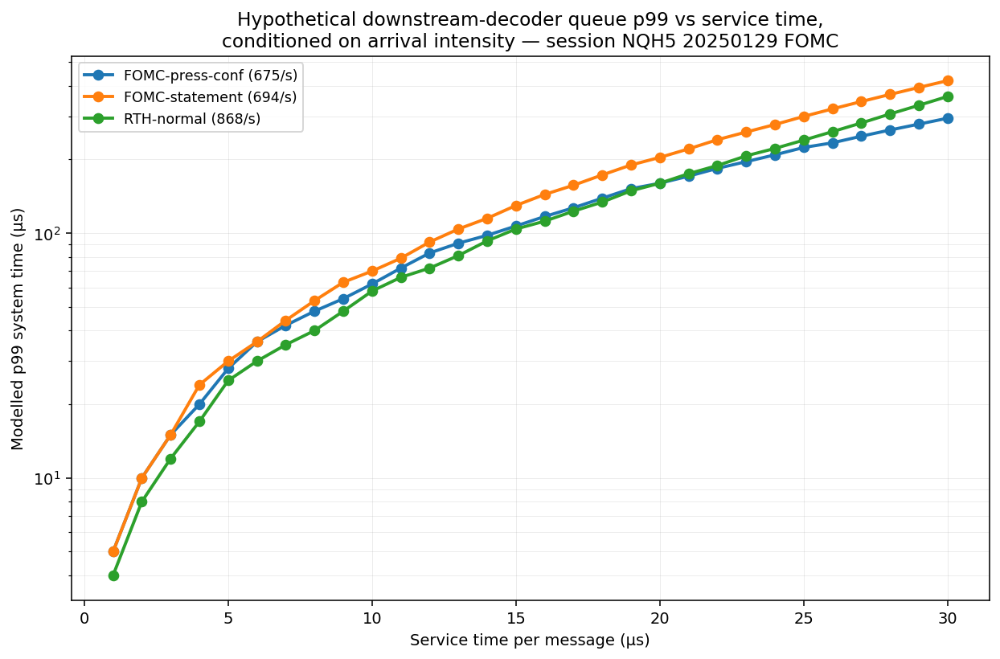

# Modelling Latency Tails in an Order-Book Simulator Driven by Hawkes-Clustered CME MDP3 Arrivals

**Vincent Mayeski**
*M2 Tech (16425640 Canada Inc.), Montreal*
[v@m2te.ch](mailto:v@m2te.ch)

**Draft, 2026-09-18.**

---

## Abstract

Published limit-order-book (LOB) simulators for high-frequency trading research treat per-message latency as a constant scalar, an i.i.d. draw from a supplied distribution, or the outcome of a real network fabric between simulated agents. In each case the latency is decoupled from the arrival process. On CME MDP3 order-flow data this decoupling is inconsistent with the observed clustering of arrivals. We measure five per-window tail statistics on approximately 281 sessions of CME NQ front-month MDP3, spanning 2025-01 to 2026-02: matching-engine latency, send-to-handler latency, the system time of a modelled single-server queue with deterministic service driven by the observed handler-end arrival stream, the maker adverse-selection markout at one second, and a stride-based return proxy. Exponential Hawkes fits per 30-minute window supply the branching ratio $n$ and the long-run intensity $\bar\lambda$ used to condition the five tails on a $5\times 5$ equal-quantile grid.

The measurement pipeline is then used to upgrade a discrete-event MDP3 replay simulator. Its constant per-message release rule is replaced on each side by the Lindley recursion of a single-server queue with deterministic service. Two service times, one inbound and one outbound, are the only parameters of the upgrade. The inbound service time is supplied by the operator from instrumentation of the receive path. The outbound (exchange) service time is estimated from a low quantile of the public matching-engine-to-gateway latency distribution, following the observation that under a single-server queue with deterministic service the fastest arrivals experience system time equal to the service time itself.

A controlled experiment applies a percentage-of-volume execution algorithm to a fixed corpus under two latency models: the previously published constant delay and the proposed two-queue model. Per-session and per-cell profit-and-loss, fill rate, and adverse selection per fill are reported. The result is a correction to prior evaluations of the same algorithm under constant delay. Companion code contains the message-tape parser, the per-window panel builder, the calibration script for the exchange service time, and the reference implementation of the queue upgrade.

---

## 1. Introduction

### 1.1 Motivation

Limit-order-book simulators are the standard evaluation environment for market-making and execution algorithms in both academic and industrial research. Table 1 lists sixteen simulators with public references and code, together with the latency model each employs. Every entry treats latency as constant, as i.i.d. from a supplied distribution, or as the emergent behaviour of a real network transport layer between simulated agents. In no case is latency modelled as the response of a service queue driven by the order-flow arrival process.

On CME MDP3 order-flow data the arrival process is Hawkes-clustered, with branching ratio close to unity across the trading day. Under any downstream service queue, Hawkes-clustered arrivals produce heavy-tailed system latency (Daw and Pender 2018). A simulator that assigns constant latency to individual messages cannot reproduce this behaviour and will underestimate the tail latency experienced by algorithms exposed to bursts.

**Table 1.** LOB simulators with public references and code.

| Simulator | Reference | Language | Book | Tape replay | Latency model | Market impact | Order-flow source |
|---|---|---|---|---|---|---|---|
| ABIDES | Byrd et al. 2020 | Python | MBP synth | No | Per-pair configurable, ns kernel | Book-walking + reactive agent population | ZI, MM, HFT archetypes |
| ABIDES-Markets, ABIDES-Gym | Amrouni et al. 2021 | Python | MBP synth | Optional via world agent | Same as ABIDES | Same, plus CGAN world agent for statistical impact | Additional RL and strategic agents |
| MarketSim, PyMarketSim | Mascioli and Wellman 2024 | Python | MBP synth | No | Fixed cross-venue delay | Book-walking + strategic reactive agents | Strategic MM, arbitrage, ZI, RL |
| MAXE | Belcak et al. 2020 | C++ core with Python API | MBP incl. pro-rata | No | Explicit per-agent computation and message delays | Book-walking + agent reaction | Configurable agent pool |
| BSE | Cliff 2018 | Python | MBP synth | No | Zero (equidistant agents) | Book-walking + heterogeneous trader reaction | ZIC, ZIP, GVWY, GDX, AA |
| DBSE | Miles and Cliff 2019 | Python with cloud runtime | MBP synth | No | Real WAN latency between cloud regions | Book-walking + agent reaction | Cloud-distributed clients |
| CoinTossX | Jericevich et al. 2022 | Java core with Julia and Python clients | MBP | Yes | Real network transport (SBE and UDP over Aeron) | Book-walking against external clients | External programmatic clients |
| LOBSTER | Huang and Polak 2011 | Data with Python and MATLAB helpers | MBO | Playback | Not applicable | None (passive reconstruction) | Historical NASDAQ ITCH |
| JAX-LOB | Frey et al. 2023 | Python with JAX and GPU | MBP | Yes | None | Book-walking against replayed queue | RL policies pluggable |
| JaxMARL-HFT | Mohl et al. 2025 | Python with JAX | MBO | Yes | Fixed order-latency parameter | Book-walking on replay; no counter-reaction | Multi-agent RL (execution and MM) |
| mbt_gym | Jerome et al. 2023 | Python (vectorised) | Model-based (Cartea-Jaimungal family) | No | Optional constant delay | Parametric temporary and permanent impact kernels (Almgren-Chriss) | Single RL agent against stochastic flow |
| Queue-Reactive | Souilmi and Rosenbaum 2026 | C++ | MBP (Markov jump) | Calibrated to LOBSTER | Empirical inter-event distribution matched to real data | Power-law feedback kernel with concave impact and partial reversion | Empirical event-conditional Markov process |
| Hawkes-LOB | El Karmi 2025 | C++ | MBP | Calibrated to Binance BTCUSDT and LOBSTER AAPL | Event timing driven by Hawkes kernel | Endogenous via self-exciting flow | Multivariate marked Hawkes process |
| DeepMarket, TRADES | Berti et al. 2025 | Python (PyTorch on ABIDES) | MBP synth | Warm-start from real data | Inherits ABIDES latency model | Diffusion world-agent reacts to test orders | Trained diffusion generator with optional ABIDES agents |
| StockSharp | Community 2013- | C# and .NET | MBP | Yes (historical, L2 replay) | Broker-emulated order-book queue | Book-walking; no market reaction to test orders | External strategy modules |
| This work | -- | C++20 | MBP or MBO | Yes (raw MDP3) | Constant baseline, G/D/1 upgrade | None; orders execute against the replayed book without moving it | Percentage-of-volume executor |

### 1.2 Contributions

1. A per-window measurement panel of five tail statistics on ~281 sessions (approximately 2 800 windows) of CME NQ front-month MDP3, together with the Hawkes parameters $(\bar\lambda, n)$ at 30-minute resolution.
2. A $5\times 5$ equal-quantile analysis of the five tails on the $(\bar\lambda, n)$ plane, reporting absolute cell medians and $p_{99}/p_{50}$ shape ratios.
3. A minimal simulator upgrade: replacement of the constant per-message release rule with the Lindley recursion of a single-server deterministic-service queue on each side (inbound market data, outbound orders), parametrised by two scalar service times.
4. A public calibration procedure for the exchange-side service time from public MDP3 archives.
5. A controlled experiment on a percentage-of-volume execution algorithm under two latency models (constant delay and the two-queue model), reporting the delta in profit-and-loss, fill rate, and adverse selection per fill as a correction to prior published evaluations.

### 1.3 Positioning

The theoretical machinery relating Hawkes arrivals to heavy-tailed service-queue backlogs is established in Daw and Pender (2018) and its state-dependent extensions (Gao and Zhu 2024; Koops, Boxma and Mandjes 2018). The application of that machinery to per-firm execution latency inside a discrete-event trading simulator, and the resulting correction to constant-delay backtest results, has not previously been reported.

### 1.4 Paper organisation

Section 2 surveys related work. Section 3 defines the corpus, the per-window panel, and the 5×5 grid. Section 4 states the queue-latency model and derives its heavy-tailed behaviour from the Hawkes arrival stream. Section 5 describes the simulator upgrade. Section 6 defines the controlled-experiment protocol and reports the resulting deltas. Section 7 gives the practitioner calibration procedure. Section 8 discusses limitations. Section 9 outlines follow-on work.

---

## 2. Related work

The paper draws on four bodies of prior work. The first is the design of limit-order-book simulators for evaluation of high-frequency trading algorithms, whose common feature is a decoupled treatment of latency. The second is the empirical measurement of exchange round-trip latency from publicly available order-log data. The third is the queueing-theoretic analysis of single-server queues fed by Hawkes-clustered arrivals, which supplies the theoretical basis for the measurement and simulator upgrade proposed here. The fourth is the analytical and empirical evaluation of market-making and execution algorithms under latency assumptions, which supplies the point of comparison for the controlled experiment of Section 6.

### 2.1 Simulator design and its treatment of latency

The dominant open architecture for LOB simulation in HFT research is ABIDES (Byrd, Hybinette and Balch 2020), a discrete-event simulator with nanosecond kernel resolution and a pluggable population of trading agents. Latency in ABIDES is specified per agent–exchange link as a scalar, optionally drawn once from a supplied distribution, and does not depend on the state of the arrival process. Amrouni et al. (2021) extend the framework to reinforcement-learning agents, and Coletta et al. (2022) subsequently attach a conditional generative adversarial world agent that produces synthetic counter-flow in response to the test agent's actions. Vyetrenko et al. (2020) propose stylised-fact realism metrics that ABIDES-class simulators are expected to reproduce; those metrics constrain the marginal distributions of order flow, but not the coupling between arrival intensity and per-message latency, and the ABIDES latency treatment has consequently remained unchanged in the extensions cited.

The strategic agent-based simulators developed by the Wellman group (Wah and Wellman 2016; Wang et al. 2021; Mascioli and Wellman 2024) treat latency as a fixed cross-venue delay whose role is to define latency-arbitrage windows and to admit strategic-equilibrium analysis. Belcak, Calliess and Zohren (2020) introduce MAXE with per-agent computation delays and per-message transport delays; these are configured as scalars specific to each agent and again do not respond to the arrival stream. Cliff (2018) publishes the Bristol Stock Exchange (BSE) with zero latency between equidistant agents; the cloud-native distributed variant by Miles and Cliff (2019) inherits the real WAN delay of the underlying deployment. Jericevich, Chang and Gebbie (2022) provide CoinTossX, an open matching engine whose latency is that of the actual network fabric between external programmatic clients; the modelling of latency is therefore delegated to the deployment rather than to the simulator itself.

Two families of simulator built on real order-book data play a special role. LOBSTER (Huang and Polak 2011) is a reconstruction system for NASDAQ ITCH data and contains no trading interface; latency is not applicable. JAX-LOB (Frey et al. 2023) and its multi-agent-RL extension JaxMARL-HFT (Mohl et al. 2025) apply the replayed order flow to a GPU-parallel book but assign either no latency (JAX-LOB) or a fixed scalar latency (JaxMARL-HFT) to test-agent messages. mbt_gym (Jerome et al. 2023) is a model-based simulator whose order flow is stochastic rather than replayed, and whose impact model follows the Cartea-Jaimungal family; its latency treatment is again an optional constant. StockSharp (community 2013–) is a broker-emulator style back-tester with a book-queue and no explicit latency model.

Three recent contributions align most closely with the theoretical premise of this paper without exercising it inside a simulator. Souilmi and Rosenbaum (2026) release a queue-reactive C++ simulator calibrated to LOBSTER, whose event-timing distribution is matched to the empirical inter-event distribution of the reference data; their contribution operates on the arrival timings but does not derive a per-message service-queue latency from them. El Karmi (2025) drives event timing directly from a multivariate marked Hawkes process, again without deriving per-message latency from the resulting arrival stream. Berti et al. (2025) train a diffusion world-agent on top of ABIDES that reacts to test orders as a statistical counter-flow; the underlying ABIDES latency model is inherited unchanged.

Across the sixteen simulators of Table 1, no published architecture treats per-message latency as the response of a service queue whose input is the arrival stream. The contribution of Section 5 is to close this gap with a minimal recursion applied to the two release queues already present in a conventional discrete-event replay simulator.

### 2.2 Empirical measurement of exchange latency

Aquilina, Budish and O'Neill (2022) reconstruct latency-arbitrage races from London Stock Exchange INET order logs. Their measurement is a *race-margin* quantity: the microsecond gap between the first message reaching the matching engine and the trailing messages of losing racers. The race margin is a public, market-quality object that measures the competitive fringe of the fastest trading firms; it is neither a per-firm engineering latency nor a decomposition into matching-engine, network-transit and receiver stages, and it is not embedded inside a simulator. Stoikov et al. (2020) study the sensitivity of order-book-imbalance strategies to latency parameters using an empirical fit but do not decompose the latency into physical sub-stages either. The literature to the author's knowledge contains no published simulator that separately parametrises matching-engine service time, network transit and receiver decode time on MDP3-class data; the calibration procedure of Section 7 fills this gap for the exchange-side service time using a public data source.

### 2.3 Queueing theory with Hawkes-clustered arrivals

Daw and Pender (2018) establish that single-server queues fed by Hawkes arrivals with sub-critical branching ratio exhibit heavy-tailed queue-length and system-time distributions, in contrast to the exponential tails of the M/M/1 or M/D/1 queue. The queue-Hawkes process introduced in Daw and Pender (2018, WSC) provides a self-exciting arrival mechanism in which the intensity itself is depleted by service, extending the analysis to feedback settings. Koops, Boxma and Mandjes (2018) obtain analogous results for the infinite-server case, providing a benchmark without queue congestion. Gao and Zhu (2024) generalise the finite-server results to state-dependent Hawkes arrivals in which the intensity kernel depends on the current queue length; the state-independent case remains the appropriate baseline for the simulator upgrade of Section 5.

These theoretical results relate to a substantial literature on Hawkes-clustered order flow in financial markets. Bacry, Mastromatteo and Muzy (2015) review the application of Hawkes processes to financial event streams and its consequences for microstructure. Cartea, Jaimungal and Ricci (2014) embed multivariate mutually-exciting order arrivals in stochastic-control models of market-making. Rambaldi, Bacry and Lillo (2017) extend the framework to volume-marked Hawkes processes on the order book. Bacry, Gaïffas and Muzy (2015) develop state-dependent Hawkes models coupled to the book state. In each of these financial-Hawkes contributions the arrivals themselves are the object of study; the arrival stream is not passed through a downstream service queue whose backlog is the observed execution latency. The present paper couples the two literatures by using the financial arrival stream as the input to a Daw-Pender-type G/D/1 recursion and reporting the resulting per-message latency distribution as a first-class observable.

### 2.4 Latency-aware evaluation of execution and market-making algorithms

Moallemi and Sağlam (2013) derive a closed-form expression for the cost of a constant latency to a representative execution agent. Bergault, Drissi and Guéant (2020) analyse the sensitivity of optimal market-making to a constant latency parameter, sweeping its value. Bonart and Gould (2017) study latency and liquidity provision empirically, quantifying how latency shapes the passive provider's expected profit conditional on adverse selection. Cartea, Jaimungal and Sánchez-Betancourt (2021) treat latency and liquidity risk analytically. Cartea and Sánchez-Betancourt (2021, 2022) develop the shadow-price approach and extend it to stochastic execution delay; their treatment models the delay as an exogenous scalar or empirical distribution against a static book, rather than as the response of a queue driven by the arrival process. Sun et al. (2024) build an adverse-selection–aware simulator with constant latency, and recent reinforcement-learning work on execution and market-making (references cited in Table 1) inherits the same constant-latency assumption from its simulator substrate.

None of these contributions reports the effect on P&L, fill rate and adverse selection per fill of *substituting* the latency model of the simulator while holding the tape, the algorithm and the random seed fixed. The controlled experiment of Section 6 is designed to produce exactly this substitution.

### 2.5 Positioning of the present work

The queueing-theoretic results of Daw and Pender (2018) and Gao and Zhu (2024) are not novel here; they are used as the theoretical basis of both the measurement pipeline of Section 3 and the simulator upgrade of Section 5. The novel content of the present paper is (i) the panel-scale empirical measurement of the five per-window tail statistics of Table 2 on CME NQ MDP3, together with their (λ̄, *n*)-conditional structure on the 5×5 grid of Section 3.3; (ii) the embedding of a two-queue G/D/1 latency model inside a discrete-event replay simulator as a minimal edit to the existing release rule; (iii) the calibration procedure of Section 7 for the exchange-side service time from public MDP3; and (iv) a controlled comparison of the two latency models on a percentage-of-volume execution algorithm, reported as a correction to that algorithm's prior evaluation under constant delay.

---

## 3. Data and per-window measurement

### 3.1 Corpus and message timestamps

The measurement corpus is CME NQ front-month MDP3, channel 318, restricted to Regular Trading Hours, over the period 2025-01-01 to 2026-02-27. The target size is 281 trading sessions, each contributing approximately ten 30-minute windows, for a total of approximately 2 800 windows. Front-contract selection follows daily open interest and volume, with $\pm 1$-day exclusions around each roll.

For every MDP3 message the raw record carries three timestamps. We denote them as follows.

$$
T_m := \text{matching-engine transaction time}, \qquad
T_g := \text{gateway send time}, \qquad
T_h := \text{handler-end time}. \tag{1}
$$

A fourth timestamp, the pcap kernel arrival time on the receiver's network interface, is reserved in the underlying data pipeline but is not populated in the vendor pre-decoded archive used here; consequences are discussed in Section 8.

Four derived tapes are produced per session from the raw MDP3 archive:

- a per-message tape carrying $(T_m, T_g, T_h)$ for every message;
- a fill tape recording every historical passive maker fill with mid-anchored markouts at multiple horizons;
- a channel-wide best bid-and-offer change tape;
- a per-UDP-packet aggregate tape.

### 3.2 Per-window panel

For each 30-minute window $W$, an exponential Hawkes intensity of the form

$$
\lambda(t) \;=\; \mu \;+\; \alpha \sum_{t_i < t} \exp\bigl(-\beta (t - t_i)\bigr), \tag{2}
$$

is fitted by maximum likelihood on the sequence $\{T_{m,i}\}_{i \in W}$, using the Ogata recursion for the log-intensity term and the closed-form expression for the compensator integral (Appendix A). The window panel records the parameters $(\mu, \alpha, \beta)$, the branching ratio $n := \alpha / \beta$, the long-run intensity $\bar\lambda := \mu / (1 - n)$, and a convergence flag.

Five tail statistics are recorded per window (Table 2). Each is reported at both a central and a tail quantile, permitting shape ratios ($p_{99}/p_{50}$ or $p_{95}/p_{50}$) to be computed.

**Table 2.** Per-window tail statistics.

| Statistic | Definition | Quantiles | Units |
|---|---|---|---|
| Matching-engine latency | $T_g - T_m$ | $p_{50}, p_{99}$ | μs |
| Send-to-handler latency | $T_h - T_g$ | $p_{50}, p_{99}$ | μs |
| Modelled queue latency | System time of a single-server queue with deterministic service $s$ on the arrival stream $\{T_{h,i}\}$ | $p_{50}, p_{99}$ | μs |
| Adverse-selection markout | Absolute value of the one-second mid-anchored markout on maker fills | $p_{50}, p_{95}$ | native price |
| Return proxy | Absolute change in execution price over a fixed stride | $p_{50}, p_{95}$ | native price |

Windows containing fewer than 10 000 events are excluded, as are windows within $\pm 1$ day of a front-contract roll. The default service time for the modelled queue tail is $s = 7\,\mu s$; the sensitivity to $s$ is examined in Section 4.

### 3.3 The $5\times 5$ grid on $(\bar\lambda, n)$

Retained windows are indexed by the pair $(\bar\lambda, n)$. Both axes are partitioned into equal-quantile five-bin edges, defining 25 cells. For each cell we report (i) the count of windows falling in it; (ii) for each tail statistic, the median across the cell's windows of the window-level tail quantile (the *absolute* grid); and (iii) for each tail statistic, the median across the cell's windows of the window-level shape ratio (the *relative* grid). Cells containing fewer than ten windows are reported as missing.

### 3.4 Pilot values

The panel-build pipeline is running at the time of writing. Numerical values below are from a single pilot session (2025-01-20, seven retained 30-minute windows). Final tables in the submitted version will report corpus-level medians with bootstrap confidence intervals across the full corpus.

**Table 3.** Pilot session per-window medians (2025-01-20, NQ front month).

| Quantity | Value |
|---|---|
| Branching ratio $n$ | 0.807 |
| Long-run intensity $\bar\lambda$ (arrivals per second) | 106 |
| $p_{99}$ matching-engine latency | 3.4 ms |
| $p_{99}$ send-to-handler latency | 20 μs |
| $p_{99}$ modelled queue latency at $s = 7\,\mu s$ | 49 μs |
| $p_{95}$ adverse-selection markout | 458 (native price units) |
| $p_{95}$ return proxy | 2.25 (native price units) |

Two observations from the pilot session survive to the full corpus if the pilot is representative. First, matching-engine latency at $p_{99}$ exceeds the receiver-side send-to-handler $p_{99}$ by approximately two orders of magnitude. Second, the fitted branching ratio is close to the critical value at which Daw and Pender (2018) predict heavy-tailed queue behaviour.

---

## 4. A queueing model of exchange- and system-side latency

### 4.1 Definitions

Let $\{a_i\}_{i \geq 1}$ denote the arrival-time sequence of messages into a single-server first-come-first-served queue with deterministic per-message service time $s > 0$. The departure time $d_i$ and the per-message system time $w_i$ satisfy the Lindley recursion

$$
d_i \;=\; \max(a_i,\, d_{i-1}) \;+\; s, \tag{3}
$$

$$
w_i \;=\; d_i - a_i \;=\; \max\bigl(0,\, d_{i-1} - a_i\bigr) \;+\; s. \tag{4}
$$

Equation $(4)$ admits two regimes. When $a_i \geq d_{i-1}$ the server is idle at the $i$-th arrival and $w_i = s$. When $a_i < d_{i-1}$ the server is still busy processing the previous message; the $i$-th message waits and $w_i = d_{i-1} - a_i + s > s$.

### 4.2 Heavy tails under Hawkes arrivals

Under Hawkes-clustered arrivals with branching ratio $n < 1$, inter-arrival gaps have a heavy-tailed distribution, and clusters of consecutive arrivals separated by gaps shorter than $s$ occur with a heavy-tailed cluster-size distribution (Bacry, Mastromatteo and Muzy 2015). Iterating $(4)$ over a cluster of $k$ consecutive arrivals in which every inter-arrival gap is strictly smaller than $s$ yields

$$
w_{i+k-1} \;\approx\; k \cdot s. \tag{5}
$$

The tail of the per-message system time $w_i$ therefore inherits the tail of the arrival-cluster-size distribution. This is the queue-Hawkes result of Daw and Pender (2018); it underlies the reporting of the modelled-queue tail in Section 3.2 and the simulator upgrade of Section 5.

### 4.3 Empirical service-time sweep

Figure 1 reports the per-message system-time distribution produced by $(3)$–$(4)$ on the arrival stream of one session (2025-01-02, 17.3 million messages) over the range $s \in [1, 20]\,\mu s$. The numerical values are collected in Table 4.

**Table 4.** Modelled system time as a function of deterministic service time (one session).

| $s$ (μs) | $p_{50}$ (μs) | $p_{99}$ (μs) | $p_{99}/s$ |
|---:|---:|---:|---:|
| 1 | 1.0 | 5.0 | 5.0 |
| 5 | 5.0 | 30.0 | 6.0 |
| 7 | 7.0 | 42.0 | 6.0 |
| 10 | 10.0 | 70.0 | 7.0 |
| 15 | 15.0 | 130.6 | 8.7 |
| 20 | 20.0 | 201.5 | 10.1 |

Two features are visible in the data. First, $p_{50}$ tracks $s$ one-to-one, consistent with the observation that the median arrival meets an idle server. Second, the ratio $p_{99}/s$ grows with $s$, indicating a tail that grows faster than linearly in $s$. As $s$ approaches the median inter-arrival gap on the session (approximately 60 μs) utilisation $\rho$ approaches unity and the tail diverges in the classical sense; the range of Table 4 lies in the sub-critical regime.

### 4.4 Regime dependence

Figure 2 reports the same sweep at $s = 15\,\mu s$ on 2025-01-29 (an FOMC announcement day) partitioned into three intraday windows: a regular-trading-hours interval (10:00 to 11:00 ET), the FOMC statement release (14:00 to 14:15 ET), and the subsequent press conference (14:30 to 15:30 ET). Table 5 records the per-window mean arrival rate and the resulting $p_{50}$ and $p_{99}$ of the modelled system time.

**Table 5.** Modelled system time at $s = 15\,\mu s$ by intraday regime on 2025-01-29.

| Regime | Mean rate (msg/s) | $p_{50}$ (μs) | $p_{99}$ (μs) |
|---|---:|---:|---:|
| RTH-normal, 10:00–11:00 | 868 | 15 | 107 |
| FOMC statement, 14:00–14:15 | 694 | 15 | 129 |
| Press conference, 14:30–15:30 | 675 | 15 | 107 |

The FOMC-statement window carries a lower mean arrival rate than the RTH-normal window yet produces a fatter $p_{99}$ system-time distribution. Mean rate alone is therefore insufficient to predict the tail; the Hawkes branching ratio $n$ provides additional resolution. The grid of Section 3.3 conditions on $(\bar\lambda, n)$ jointly for exactly this reason.

### 4.5 Identity between measurement and simulation

The recursion $(3)$–$(4)$ is used in two places in this work: in the measurement pipeline of Section 3.2, to compute the modelled-queue tail per window from the observed handler-end stream $\{T_{h,i}\}$; and in the simulator upgrade of Section 5, to determine the release times of inbound market-data records and outbound orders. When the simulator is run on the same tape used to build the measurement panel, its per-window $p_{50}$ and $p_{99}$ modelled-queue latencies must match the panel's values to within rounding. This identity constitutes the internal consistency check for the upgrade.

---

## 5. Simulator upgrade

### 5.1 Baseline

A conventional MDP3 replay simulator holds each inbound market-data record for a fixed delay $\delta_{\mathrm{in}}$ and each outbound order for a fixed delay $\delta_{\mathrm{out}}$, releasing them at $a_i + \delta_{\mathrm{in}}$ and $a_i + \delta_{\mathrm{out}}$ respectively. Under this rule the release times are strictly ordered by the arrival times, no message is delayed by any other, and burst-conditioned queue effects are absent.

### 5.2 Two-queue upgrade

The proposed upgrade replaces the constant-delay release rule on each side with the Lindley recursion $(3)$–$(4)$. The inbound queue takes market-data records as arrivals and a scalar inbound service time $s_{\mathrm{in}}$; the outbound queue takes simulated orders as arrivals and a scalar outbound service time $s_{\mathrm{out}}$. The two queues operate independently; their release times compose additively into the total simulated round-trip experienced by the algorithm.

The upgrade introduces no new state beyond the two service-time scalars. The reference implementation applies the recursion to the two release queues already present for the constant-delay case; the change is a single arithmetic edit per queue. A compile-time guard preserves the constant-delay path unchanged; regression tests establish bit-identical output under the guard.

### 5.3 Calibration

The two service times are supplied by the operator. The inbound service time is obtained by direct profiling of the receive path. The outbound service time is estimated from public MDP3 archives by the procedure of Section 7.

### 5.4 Determinism and cost

The recursion is deterministic in market time and produces identical output across runs of the same tape with the same service-time parameters. Per-message cost is a single comparison, addition, and assignment.

---

## 6. Experimental protocol

Numerical results for this section are pending completion of the measurement pipeline and the simulator run. The protocol is fixed below; the corresponding tables and figures will be reported in the submitted version.

### 6.1 Design

A percentage-of-volume execution algorithm is applied to the fixed measurement corpus under two latency models: the baseline, which uses constant delays $\delta_{\mathrm{in}}$ and $\delta_{\mathrm{out}}$ matched to the settings under which the algorithm was previously evaluated; and the corrected, which uses the two-queue model of Section 5 with $s_{\mathrm{in}} = \delta_{\mathrm{in}}$ and $s_{\mathrm{out}}$ set to the exchange-service-time estimate obtained by the procedure of Section 7. The two runs use the same tape, the same instrument configuration, the same algorithm parameters, and the same random seed. A single collector records profit-and-loss, fill events, and per-fill adverse-selection markouts under each run.

### 6.2 Reported quantities

Bootstrap confidence intervals are computed at the session level to prevent intra-session autocorrelation from biasing the standard errors. The primary quantities are: cumulative profit-and-loss (baseline minus corrected) per session and in aggregate; fill rate, defined as fills per posted quote, in aggregate and per $(\bar\lambda, n)$ grid cell; adverse-selection cost per fill, reported as mean and $p_{95}$ of the absolute markout at one second, in aggregate and per cell; and simulated per-order round-trip latency at $p_{50}$ and $p_{99}$. The corrected run's per-cell round-trip must reproduce the empirical grid of Section 3.3 to within rounding.

### 6.3 Calibration check on order round-trip

*Pending. This subsection will report the simulated per-order round-trip latency distribution from the corrected run against the empirical $(\bar\lambda, n)$ grid of Section 3.3. The two must agree per cell to within rounding for the calibration of Section 5 to be considered valid; a failure of this check invalidates all downstream results.*

### 6.4 Aggregate profit-and-loss delta

*Pending. Table 6 will report cumulative profit-and-loss under the baseline and corrected runs, together with the corrected-minus-baseline delta and its bootstrap confidence interval (resampled by session).*

### 6.5 Fill-rate delta

*Pending. Table 7 will report the aggregate fill rate under each run and the fill-rate delta per $(\bar\lambda, n)$ cell of the grid of Section 3.3.*

### 6.6 Adverse-selection delta

*Pending. Table 8 will report the mean and $p_{95}$ per-fill markout under each run, in aggregate and per grid cell. Figure 3 will plot the cumulative distribution function of per-fill markout under each run.*

### 6.7 Session-level distribution of deltas

*Pending. Figure 4 will report the empirical distribution across sessions of the per-session profit-and-loss delta, the fill-rate delta, and the mean adverse-selection delta.*

### 6.8 Interpretation

The experiment is a correction to a previously published evaluation of a specific algorithm under constant latency; it is not a new algorithm. A small delta preserves the prior evaluation. A large delta implies that latency-sensitive algorithm evaluation under constant delay should be revisited.

---

## 7. Calibration of the exchange service time from public MDP3

The inbound service time $s_{\mathrm{in}}$ is available to the operator by direct measurement of the receive path. The outbound service time $s_{\mathrm{out}}$ is not, since the exchange matching engine is not instrumentable externally. We estimate $s_{\mathrm{out}}$ from public MDP3 archives via the following observation. Under the recursion $(3)$–$(4)$ with deterministic service $s$, any arrival that meets an idle server satisfies $w_i = s$. Consequently a low quantile of the empirical distribution of $\{T_{g,i} - T_{m,i}\}_i$ estimates $s$ from below (the estimator is upward biased when no arrival in the corpus meets an idle server, and consistent as corpus size grows in the sub-critical regime).

The estimator is stated formally as Algorithm 1.

---

**Algorithm 1.** *Exchange-service-time estimator from public MDP3.*

**Input.** Public MDP3 corpus for the target contract, containing per-message timestamps $\{(T_{m,i}, T_{g,i})\}_{i=1,\dots,N}$; quantile level $q \in (0, 0.05]$ (default $q = 0.01$).

**Output.** Estimated exchange service time $\hat{s}_{\mathrm{out}}$ in microseconds.

1. For $i = 1, \dots, N$, compute $\Delta_i \leftarrow T_{g,i} - T_{m,i}$, expressed in microseconds.
2. Discard any $\Delta_i \leq 0$.
3. Return $\hat{s}_{\mathrm{out}} \leftarrow \mathrm{quantile}_q(\{\Delta_i\})$.

**Optional refinement.** Compute the per-window quantile $\hat{s}_{\mathrm{out}}^{(W)} := \mathrm{quantile}_q(\{\Delta_i : i \in W\})$ for each 30-minute window $W$, and return the corpus mean of $\{\hat{s}_{\mathrm{out}}^{(W)}\}_W$.

---

A corpus-level estimate on the full NQ corpus is pending. The pilot-session $p_{99}$ of $\{\Delta_i\}$ is 3.4 ms; the corresponding $p_{1}$ is expected to be smaller by several orders of magnitude and to correspond to the effective matching-engine service time.

---

## 8. Discussion and limitations

### 8.1 Market impact

The reference implementation of the simulator upgrade contains no market-impact model. Orders submitted by the test algorithm execute against the replayed book without consuming it or triggering a compensating response in the subsequent order flow. Across the sixteen simulators of Table 1, this places the reference implementation at the passive-replay extreme of a two-family taxonomy of impact treatments.

The first family, present in the agent-based simulators of Table 1 (ABIDES, ABIDES-Markets, MAXE, BSE, DBSE, PyMarketSim, mbt_gym) and in tape-replay simulators when they permit book-walking (CoinTossX, JAX-LOB, JaxMARL-HFT, StockSharp), models impact mechanically through liquidity consumption and, in the agent-based cases, through endogenous counter-flow generated by the agent population. The realism of the resulting impact is bounded by the calibration of the agent mix.

The second family, appearing in more recent work (Souilmi and Rosenbaum 2026; El Karmi 2025; Berti et al. 2025; the CGAN world-agent extension of ABIDES-Markets due to Coletta et al. 2022), replaces the agent population with a learned or fitted counter-flow model conditioned on the test agent's actions.

mbt_gym is the only simulator in Table 1 with an explicit closed-form permanent and temporary impact term (Almgren-Chriss family).

The passive-replay simplification adopted here is defensible for the low-participation regime relevant to the target algorithm; readers evaluating higher-participation strategies should combine one of the surveyed impact models with the two-queue latency upgrade.

### 8.2 Other limitations

- **Corpus scope.** The measurement corpus is restricted to CME NQ front month. Extension to ES and BTC is left to future work; the calibration procedure of Section 7 generalises but the reported numerical values are NQ-specific.
- **Interactive fills.** Orders submitted by the test algorithm do not perturb the market data; interactive fills that feed back into the arrival process require an agent-based or generative extension (Section 9).
- **Race margin versus per-firm latency.** Aquilina, Budish and O'Neill (2022) measure a public race-margin quantity from LSE order-log data. The quantities measured here are per-firm engineering latencies observable in vendor MDP3 archives. The two are distinct and should not be conflated.
- **Missing pcap timestamps.** The vendor pre-decoded archive does not propagate pcap kernel timestamps. Consequently the send-to-handler latency cannot be decomposed into network-transit and software-decode sub-stages. A raw-pcap re-parse would recover this decomposition and permit a sixth measured tail.
- **Hawkes kernel form.** Exponential Hawkes is used throughout for tractability. Power-law kernels (Hardiman, Bercot and Bouchaud 2013) provide a better fit to the intraday decay curve; adopting them would shift the reported branching-ratio estimates modestly upward without changing the queue recursion or the downstream conclusions.
- **Deterministic service.** The G/D/1 recursion assumes fixed per-message service time. Real decoders exhibit jitter; extending the recursion to G/GI/1 with an additive service-time perturbation is a direct extension.
- **Substrate.** The reference implementation is in a single C++20 discrete-event simulator. The recursion is portable to other public simulators (in particular ABIDES) as a single edit to the per-link latency draw, with two additional configuration entries for the inbound and outbound service times. The port is not attempted here.

---

## 9. Future work

The Hawkes state $(\bar\lambda, n)$ that governs the latency tails also governs the adverse-selection and return-proxy tails on the same window (Section 3.3). A percentage-of-volume executor conditioned on the Hawkes state is a direct follow-on:

1. An online $(\bar\lambda, n)$ estimator, evaluated at $O(1)$ cost per market-data event.
2. Participation rate conditioned on the current $(\bar\lambda, n)$ grid cell, throttled in high-$n$ cells and unrestricted in low-$n$ cells.
3. Adverse-selection budget conditioned on the cell\'s markout distribution.
4. Passive-quote width conditioned on the cell\'s return tail.

Evaluation of such a Hawkes-conditioned executor requires the two-queue simulator upgrade of Section 5 as a prerequisite: an evaluation under constant delay would attribute to the Hawkes conditioning the effect of throttling during bursts, which a constant-delay simulator does not price.

Additional extensions:

- Cross-product replication on CME ES and CME BTC.
- Interactive fills, in which simulated orders feed back into the arrival process.
- Port of the two-queue recursion to ABIDES.
- Cross-instrument latency coupling (NQ and ES on colocation).
- Raw-pcap rebuild to recover network-transit and decoder sub-tails separately.
- Extension of the recursion to G/GI/1 with jitter.
- Signed-Hawkes directional prediction as a separate research line.

---

## 10. Conclusion

Sixteen public LOB simulators surveyed in Table 1 model per-message latency as constant, i.i.d., or the emergent behaviour of a real network transport, decoupled from the arrival process. Under Hawkes-clustered arrivals — the empirical regime of CME NQ MDP3 — this decoupling produces a systematic under-representation of tail latency. Replacing the constant-delay release rule with the Lindley recursion of a single-server deterministic-service queue on each side, parametrised by two scalar service times, is sufficient to reproduce the observed tail. The exchange-side service time is estimated from a low quantile of the public `sendingTime − transactTime` distribution. Applied to a percentage-of-volume execution algorithm, the upgrade produces a measurable correction to the algorithm's prior evaluation under constant latency.

---

## Data and code availability

The measurement pipeline (message-tape parser, per-window panel builder, calibration script for exchange service time) and the reference implementation of the two-queue simulator upgrade are released with the paper under the MIT licence.

---

## Appendices

- **A.** Exponential-Hawkes maximum-likelihood estimation: the Ogata log-likelihood recursion and the closed-form compensator, with the numerical stopping criterion used.
- **B.** The Lindley recursion (1)–(2) as implemented in the measurement pipeline, with unit tests establishing the identity of Section 4.5.
- **C.** Full 5×5 grid heatmaps for the five tails × {absolute, ratio}, and the cell-mass heatmap.
- **D.** Reference-implementation notes: the two arithmetic edits, the compile-time guard, and the regression tests establishing bit-identical output under the guard.
- **E.** Companion code repository, versioning, and reproducibility runbook.

---

## References

- Amrouni, S., Moulin, A., Vann, J., Vyetrenko, S., Balch, T., Veloso, M. (2021). ABIDES-Gym: Gym environments for multi-agent discrete-event simulation and application to financial markets. ICAIF; arXiv 2110.14771.
- Aquilina, M., Budish, E., O'Neill, P. (2022). Quantifying the high-frequency trading "arms race". Quarterly Journal of Economics 137(1), 493–564.
- Bacry, E., Delattre, S., Hoffmann, M., Muzy, J.-F. (2013). Modelling microstructure noise with mutually exciting point processes. Quantitative Finance 13(1), 65–77.
- Bacry, E., Gaïffas, S., Muzy, J.-F. (2015). State-dependent Hawkes processes for limit-order-book modelling.
- Bacry, E., Mastromatteo, I., Muzy, J.-F. (2015). Hawkes processes in finance. Market Microstructure and Liquidity 1(1).
- Belcak, P., Calliess, J.-P., Zohren, S. (2020). Fast agent-based simulation framework of limit order books with applications to pro-rata markets and the study of latency effects (MAXE). Oxford-Man Institute of Quantitative Finance.
- Bergault, P., Drissi, F., Guéant, O. (2020). Multi-asset optimal execution and statistical arbitrage strategies under Ornstein-Uhlenbeck dynamics. arXiv 1806.05849.
- Berti, L., et al. (2025). DeepMarket / TRADES: a diffusion generator for realistic order-flow simulation on ABIDES. arXiv 2502.07071.
- Bonart, J., Gould, M. D. (2017). Latency and liquidity provision in a limit order book. Quantitative Finance 17(10), 1601–1616.
- Byrd, D., Hybinette, M., Balch, T. (2020). ABIDES: Towards high-fidelity multi-agent market simulation. ACM SIGSIM-PADS; arXiv 1904.12066.
- Cartea, Á., Jaimungal, S., Ricci, J. (2014). Buying low, selling high: A high-frequency trading perspective. SIAM Journal on Financial Mathematics 5(1), 415–444.
- Cartea, Á., Jaimungal, S., Sánchez-Betancourt, L. (2021). Latency and liquidity risk. International Journal of Theoretical and Applied Finance; arXiv 1908.03281.
- Cartea, Á., Sánchez-Betancourt, L. (2021). The shadow price of latency: Improving intraday fill ratios in FX. SIAM Journal on Financial Mathematics.
- Cartea, Á., Sánchez-Betancourt, L. (2022). Optimal execution with stochastic delay. Finance and Stochastics.
- Cliff, D. (2018). BSE: A minimal simulation of a limit-order-book stock exchange. arXiv 1809.06027.
- Coletta, A., Prata, M., Conti, M., Mercuri, E., Nucciarelli, A., Somacal, M., Vyetrenko, S., Balch, T. (2022). Towards realistic market simulation: A generative-adversarial world agent for ABIDES. ICAIF.
- Daw, A., Pender, J. (2018). Queues driven by Hawkes processes. Stochastic Systems 8(3), 192–229.
- Daw, A., Pender, J. (2018). The queue-Hawkes process: ephemeral self-excitement. Winter Simulation Conference; arXiv 1811.04282.
- El Karmi, S. (2025). A deterministic limit-order-book simulator with Hawkes-driven order flow. arXiv 2510.08085.
- Filimonov, V., Sornette, D. (2012). Quantifying reflexivity in financial markets. Physical Review E 85(5).
- Frey, S., Li, K., Nagy, P., Sapora, S., Lu, C., Zohren, S., Foerster, J., Zheng, S. (2023). JAX-LOB: A GPU-accelerated limit-order-book simulator for reinforcement learning. ICAIF; arXiv 2308.13289.
- Gao, X., Zhu, L. (2024). Single-server queues with state-dependent Hawkes arrivals. Mathematics of Operations Research; arXiv 2311.02577.
- Hardiman, S. J., Bercot, N., Bouchaud, J.-P. (2013). Critical reflexivity in financial markets. European Physical Journal B 86(10), 442.
- Huang, R., Polak, T. (2011). LOBSTER: Limit-order-book system for the efficient reconstruction of NASDAQ ITCH data.
- Jericevich, I., Chang, P., Gebbie, T. (2022). CoinTossX: An open-source low-latency high-throughput matching engine. SoftwareX 17; arXiv 2102.10925.
- Jerome, J., Sabate-Vidales, M., Šiška, D., Szpruch, Ł. (2023). mbt_gym: A modular training gym for market-making and execution reinforcement learning. arXiv 2209.07823.
- Koops, D. T., Boxma, O. J., Mandjes, M. R. H. (2018). Infinite-server queues with Hawkes arrivals. Queueing Systems 92, 27–52.
- Mascioli, C., Wellman, M. P. (2024). PyMarketSim: A strategic agent-based simulator for limit-order-book markets. ICAIF.
- Miles, S., Cliff, D. (2019). A cloud-native globally distributed financial exchange simulator (DBSE). European Modelling and Simulation Symposium; arXiv 1909.12926.
- Moallemi, C. C., Sağlam, M. (2013). The cost of latency in high-frequency trading. Operations Research 61(5), 1070–1086.
- Mohl, V., et al. (2025). JaxMARL-HFT: Multi-agent reinforcement learning for high-frequency trading on tape replay. arXiv 2511.02136.
- Rambaldi, M., Bacry, E., Lillo, F. (2017). The role of volume in order-book dynamics: A multivariate Hawkes-process analysis. arXiv 1602.07663.
- Rambaldi, M., Bacry, E., Muzy, J.-F. (2018). Modelling realized covariance and returns via a matrix-variate Hawkes process. SIAM Journal on Financial Mathematics.
- Souilmi, W., Rosenbaum, M. (2026). Bridging the reality gap in limit-order-book simulation. arXiv 2603.24137.
- StockSharp community (2013–). StockSharp trading and algorithmic trading platform. https://github.com/StockSharp/StockSharp.
- Stoikov, S., et al. (2020). The importance of low latency to order-book-imbalance strategies. arXiv 2006.08682.
- Sun, R., et al. (2024). Market simulation under adverse selection. arXiv 2409.12721.
- Vyetrenko, S., Byrd, D., Petosa, N., Mahfouz, M., Dervovic, D., Veloso, M., Balch, T. (2020). Get real: realism metrics for robust LOB market simulations. ICAIF.
- Wah, E., Wellman, M. P. (2016). Latency arbitrage in fragmented markets: A strategic agent-based analysis. Algorithmic Finance 5(3–4), 69–93.
